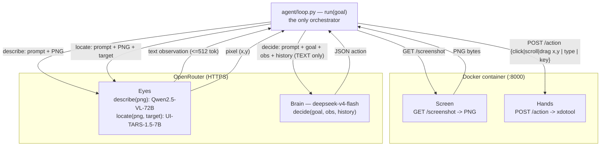
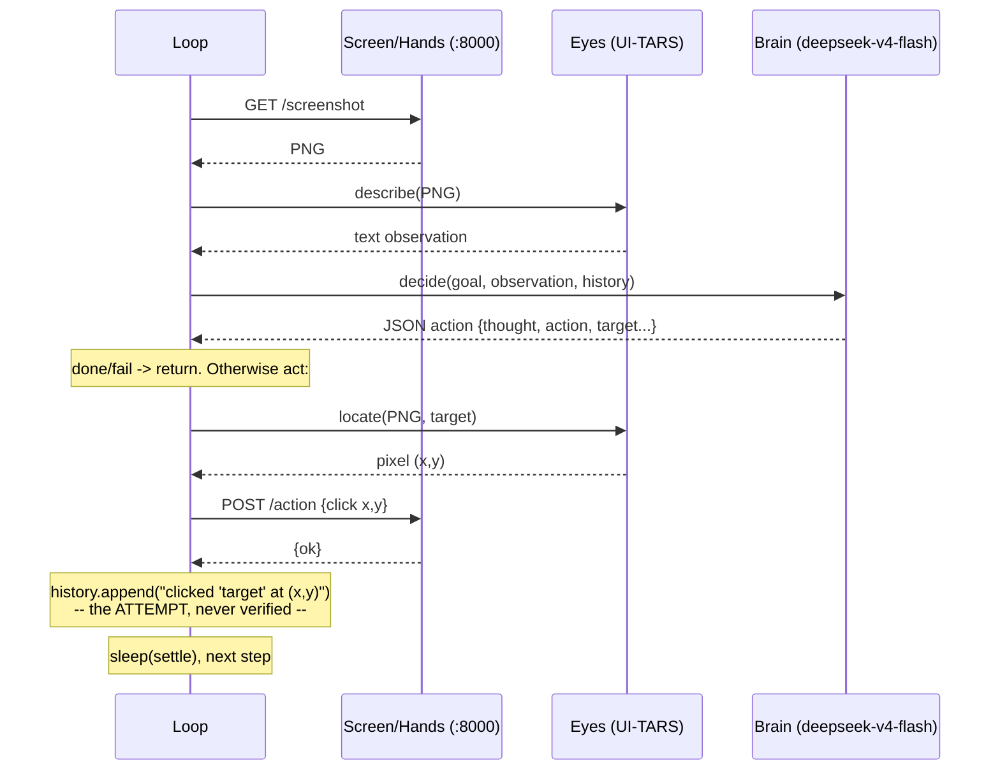
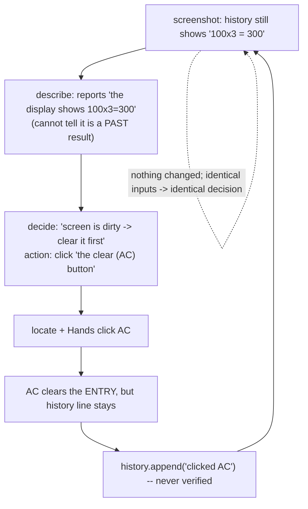
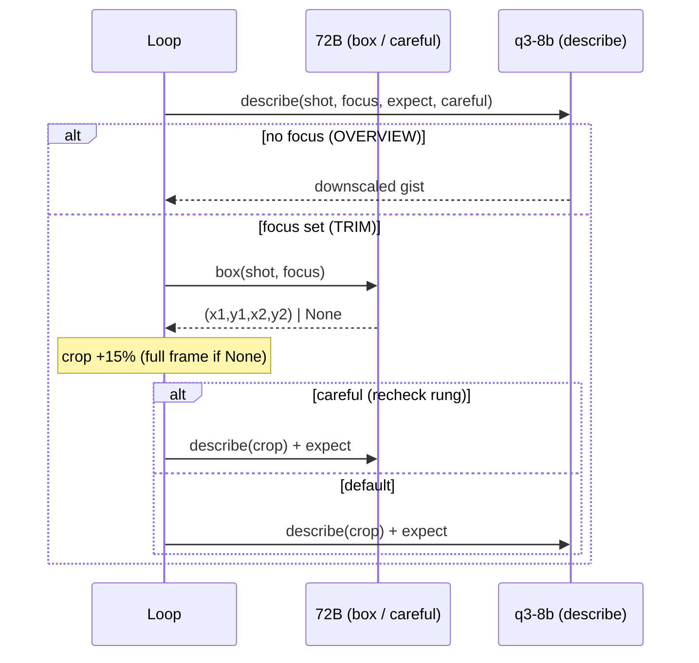

# BRYES — Agent Loop: Wiring & Data Flow

**What this doc is:** the *flow* view of BRYES — who is connected to whom, over what
transport, and exactly what each piece is fed and emits each step. It complements
[architecture-overview.md](architecture-overview.md), which is the *structural* view
(what the pieces are, model slugs, coordinate convention). For those static facts,
read that; for "how does one step actually move through the system, and where does it
break," read this.

It closes with the **1024 clear-loop post-mortem** — the concrete Phase-4 failure that
motivates Phase 5 — traced through the two seams this flow exposes.

---

## 1. How the four pieces connect

Everything fans through **one orchestrator**: [`agent/loop.py`](../agent/loop.py)
`run(goal)`. The four pieces **never call each other** — the loop calls each in turn
and carries the data between them. There is no peer-to-peer wiring to reason about;
there is only the loop.

Two transports, two homes:

| Piece | Home | Transport | Entry point |
|---|---|---|---|
| **Screen** | local Docker container | HTTP `:8000` | `GET /screenshot` |
| **Hands** | *same* container (not a separate service) | HTTP `:8000` | `POST /action` (runs `xdotool`) |
| **Eyes** | rented, OpenRouter — Qwen2.5-VL-72B (`describe`) + UI-TARS-1.5-7B (`locate`) | HTTPS | `describe()`, `locate()` |
| **Brain** | rented, OpenRouter (`deepseek-v4-flash`, swappable; backup `gemini-2.5-flash-lite`) | HTTPS | `decide()` |



**Key structural fact:** Screen and Hands share one container and one HTTP port; Eyes
and Brain share one OpenRouter key. Nothing runs *inside* anything else. The loop is
the single point where all four are stitched together.

---

## 2. What each piece is fed, and what it emits

This is the "what prompt / what feed flows to each other" answer. Per step:

| # | Call | Fed (input / prompt) | Emits | Source |
|---|---|---|---|---|
| 1 | `screenshot()` | — | PNG bytes | [screen/server/app.py](../screen/server/app.py) |
| 2 | `describe(png, focus?)` | `DESCRIBE_PROMPT` + optional **focus** + PNG → **Qwen2.5-VL-72B** | **text** report that separates the *live entry* from *history* (<=512 tok) | [eyes/client.py](../eyes/client.py) |
| 3 | `decide(goal, obs, history)` | `SYSTEM_PROMPT` + `{goal, observation, history}` — **text only**, Think High (`reasoning.effort=high`) | JSON `{thought, action, target?, destination?, direction?, seconds?, text?, key?, command?, timeout?, focus?}` | [brain/client.py](../brain/client.py) |
| 4 | `locate(png, target)` | `GROUND_PROMPT(target)` + PNG → **UI-TARS-1.5-7B** | pixel `(x,y)` (+ diagnostics) | [eyes/client.py](../eyes/client.py) |
| 5 | `hands(payload)` | point actions `{type: click\|double_click\|right_click\|hover, x, y}`, `{type: scroll, x, y, direction}`, `{type: drag, x, y, x2, y2}`, `{type: type, text}`, `{type: key, key}` | xdotool executes; `{ok}` | [screen/server/app.py](../screen/server/app.py) |
| 6 | `exec_cmd(payload)` (shell action only — no describe/locate) | `{command, timeout?, stdin?}` → `POST /exec` (subprocess `shell=True`, sandboxed) | `{ok, exit_code, stdout, stderr}` — threaded into HISTORY | [screen/server/app.py](../screen/server/app.py) |

Notes that matter for Phase 5:

- **The Brain never sees the PNG.** Steps 2 and 3 are where pixels become text and the
  Brain reasons on that text alone. This is **Seam A** (below).
- **`describe` and `locate` are two separate Eyes calls on the *same* screenshot.**
  `describe` is a general report (step 2); `locate` is targeted grounding for the one
  element the Brain named (step 4). `locate` re-uses the screenshot taken at the *top*
  of the step, so grounding is consistent with what the Brain reasoned about.
- **The Brain names targets in words, not pixels** (`"the equals (=) button"`), because
  UI-TARS mislocates bare symbols. The Eyes turn that phrase into `(x,y)`.
- **(2026-07-12) The Brain now steers the Eyes and remembers outcomes.** `decide` returns
  an optional `focus` that the loop carries into the *next* `describe`; `history` now
  pairs each step's observation with the action taken; the Brain runs Think High. See
  *First Phase-5 cut* (§6).

---

## 3. One step, end to end



Narration, keyed to [`agent/loop.py`](../agent/loop.py):

1. **Screenshot** the current desktop (top of every step — one fresh frame per step).
2. **`describe`** it → a text observation for the Brain.
3. **`decide`** from `goal + observation + history` → one JSON action.
4. If the action is `done`/`fail`, return. Otherwise it is a **point action**
   (`click`/`double_click`/`right_click`/`hover`/`scroll`/`drag`), `type_into` (the one-shot
   text-entry combo — see step 5), `type`, `key`,
   `wait` (pause `seconds` for a loading screen — no UI touch), `screenshot` (save the
   current frame as a deliverable `capture-NN.png` — no UI touch), or `shell` (run a command
   via `POST /exec` — no locate, no UI touch; the exit code + output thread into HISTORY).
5. For a point action, **`locate`** the named `target` on the *same* screenshot → `(x,y)`
   (a `drag` also locates its `destination`), then **Hands** execute it. `type`/`key` go
   straight to the Hands (no locate — `type` hits whatever the Brain already focused).
   **`type_into`** grounds its optional `click_target` here (if present), then hands the whole
   *[click? → clear? → type → Enter?]* gesture to the body (`device.type_into`) — one Brain
   decision, one device-composed gesture (≤1 click, first, since grounding is per-frame).
6. **Append to history** a string describing the *attempted* action, then settle and loop.

---

## 4. The two lossy seams (why Phase 5 exists)

The flow above has exactly two places where information is lost. Every Phase-4 failure
we have seen lands on one of them.

### Seam A — the Brain is blind (pixels -> text, one way)

The Brain never receives the PNG. Its entire model of the world is `describe`'s
<=512-token text plus the history strings. Two consequences:

- **Compression:** anything `describe` omits or garbles, the Brain cannot recover.
- **No live-vs-history distinction:** `describe` reports *all visible text as-is*. It has
  no concept of "current input field" vs "log of a past result." If both are on screen,
  the Brain is handed both as equally-current facts.

> **Addressed (2026-07-13):** the live-vs-history half of this seam is largely closed —
> `describe` moved from UI-TARS (a grounding fine-tune that flattened history into the
> current state) to a general VLM (**Qwen2.5-VL-72B**) that explicitly labels the *live
> entry* vs *history*. The Brain is still text-only (compression remains), but it now
> gets a faithful, structured reading. See §6.

### Seam B — history is authored, not observed (no verification)

After acting, the loop appends a string describing what it *tried*
([loop.py:79](../agent/loop.py#L79)) — it never compares the next screenshot to confirm
the action changed anything. So:

- **A misclick is invisible.** "clicked the AC button at (x,y)" is recorded identically
  whether AC did something, did nothing, or hit the wrong element.
- **No progress model.** The Brain *does* receive the history every step
  ([loop.py:58](../agent/loop.py#L58) -> `HISTORY` in the prompt), so it can see it has
  clicked AC five times. But the history records *attempts, not outcomes*, and the Brain
  is not instructed to treat "same action, no change" as futile — so repetition is
  **visible yet unflagged**. If the observation hasn't changed, it makes the same
  decision again. Memory of actions is not enough; Phase 5 needs outcomes *in* the memory
  plus reasoning that stops on repetition.

> **Seam B is Phase 5.** The roadmap's differentiator — *"after each action, check the
> new screenshot: did the thing I intended actually happen? If not, recover"* — is
> precisely the verification this loop does not yet do.

> **✅ Seam B closed (2026-07-16, Phase 5 — see §8 + [ADR-003](adr/2026-07-16-change-feedback-verify-and-recover.md)).** The Brain now emits a `expect` with each action; the loop rides it into the next `describe`, which **REPORTS the actual state** of that thing (`VERIFICATION: <what's shown>`) — grounded perception, not a verdict — and the Brain compares it to what it expected. History no longer just records an unverified attempt — the *next observation* carries a grounded reading of what the last action produced. (Two design choices, both measured: change-feedback is **semantic not pixel** — a whole-frame pixel diff was dropped; and the VLM **reports, doesn't judge** — binary verdicts were noisy. See §8.)

> **Shell is the exception to Seam B.** A `shell` action's HISTORY entry carries the command's
> *real* exit code + stdout (observed from `/exec`), not an unverified "I tried X." So the
> shell channel already has the outcome-in-memory that GUI actions lack — verification is
> built into its result, not deferred to a screenshot compare. (2026-07-15, [ADR-001](adr/2026-07-15-effector-hierarchy.md).)

---

## 5. Post-mortem: the 1024 clear-loop

**The failure (Phase 4, gnome-calculator).** The prior `100x3=300` task succeeded and
left that line in gnome-calculator's **history/scrollback**. New goal: `1024x921/73`.
The agent clicked **AC (All Clear)** over and over and **never typed a digit**, looping
until the step budget ran out.

**Mechanism — the same three text/observation values recur every step:**



**Three layered causes (root -> trigger):**

1. **Root 1 - Seam B (no verify / no progress model).** "I clicked AC and nothing
   changed" is invisible, so the Brain repeats the same move on an unchanged observation.
   Even a trivial *"the screen didn't change after my last action, stop repeating it"*
   breaks the loop. **Highest-leverage fix — it catches this whole class of failure
   regardless of the app.**
2. **Root 2 - Seam A (describe conflates history with live state).** A structured,
   task-directed describe (e.g. `current entry: empty | history: 100x3=300`) would let
   the Brain ignore the stale log and see the entry is actually empty.
3. **Trigger - gnome-calculator's AC is not a blank slate.** AC clears the current entry
   but not the scrollback. The agent's implicit model ("clear = clean screen") is false
   for this app. This environmental quirk is the *match, not the gas*: it merely
   **exposes** Roots 1 and 2.

**Fix priority for Phase 5:** verification / no-progress detection (Root 1) generalizes
and should come first; structured/task-directed describe (Root 2) removes the trigger for
display-with-history apps specifically. Both are on the Phase-5 table; Root 1 is the
product.

---

## 6. First Phase-5 cut (implemented 2026-07-12) + what remains

Changes aimed at the two seams above — verified live (see "Verified" below).

| Change | What | Attacks |
|---|---|---|
| **Outcomes in memory** | `history` now pairs each step's *observation* with the *action taken* (`saw: … / did: …`), not just the action | **Seam B** — gives the Brain the material to see "I acted, screen unchanged" across steps |
| **Think High** | Brain runs `reasoning.effort=high` (`max_tokens` raised 4096->8192 for trace + JSON headroom) | **Seam B** — the reasoning that *uses* the paired history to judge progress and stop repeating a futile action. No hardcoded "don't repeat" rule — that inference is the reasoning model's job |
| **Task-directed describe** | Brain emits an optional `focus`; the loop carries it into the next `describe`, which then concentrates on that area and distinguishes a live entry from a log of past results | **Seam A** — the Eyes report the task-relevant area in detail instead of a flat dump; removes the history-vs-live conflation that triggered the 1024 loop |

Note the split of labor: **outcomes-in-memory supplies the data, Think High supplies the
reasoning to act on it.** They are orthogonal — the 1024 loop happened with reasoning
*disabled*, so the fix is to turn reasoning on over richer memory, not to bolt a
heuristic onto a mechanical decider.

**Follow-on fixes (2026-07-12/13), each from a live failure:**
- **Disambiguate by position** — name a symbol-button with its location when the symbol
  also appears in the display ("the equals button on the keypad"), else `locate` grabs
  the "=" shown in the equation.
- **English-only + `decide()` JSON retry** — flash occasionally reasoned in Chinese and
  emitted invalid JSON; a global English rule + retry-on-bad-JSON removed both.
- **VLM describe (the decisive Seam-A fix)** — `describe` moved from UI-TARS to
  **Qwen2.5-VL-72B**. UI-TARS (a grounding fine-tune) confabulated results and flattened a
  history/log into the current state; the VLM explicitly labels *live entry* vs *history*,
  killing the recurring clear-loop that prompt-tuning couldn't.

**Verified (2026-07-13):** varied calcs complete cleanly end-to-end — `1550×3÷4=1162.5`,
`128+47=175`, `512−137=375`, `7÷8=0.875`, and `12+34+56=102` **on a cluttered calculator**
(a `7÷8` result in history) — the exact scenario that clear-looped before.

**Update (2026-07-13, later same day):**
- **History → actions-only.** The observation+action pairing above was made obsolete by the
  accurate-but-verbose VLM describe (it *blurred* the context). History now carries only the
  `did` actions; the Brain judges from the current observation.
- **`type` is atomic.** `type` no longer clicks first — the click deselected the Brain's
  Ctrl+A → append (broke browser URL-bar entry). `type` just types into the focused field;
  the Brain focuses via an explicit `click`. Primitives stay dumb; composition belongs above.
- **Generalized to a browser + Brain chosen by bake-off.** The stack drove Google Chrome to
  search "who am I". A 5-model bake-off picked **`qwen/qwen3.6-flash`** as the default Brain
  (beat v4-pro and minimax-m3 on cost AND capability once the harness was fixed). *(Later
  replaced by `deepseek-v4-flash` — qwen degenerates under our json_schema standard in thinking
  mode; [ADR-005](adr/2026-07-16-structured-output-standard.md), 2026-07-17.)*
- **Hands primitive audit → full natural set.** Audited all primitives: `type`/`key` clean-
  atomic, `click` naturally-composite-and-safe (move-then-click clobbers nothing), `move`
  renamed to `hover` and wired to the Brain. No second `type`-class bug. Added the missing
  natural actions — `double_click`, `right_click`, `hover`, `scroll` (`direction`), `drag`
  (`target`→`destination`) — each ONE atomic xdotool call. Static-checked; not yet run live.

**Still open** (see [backlog.md](backlog.md)): the *explicit* post-action re-check/recover
step (Phase 5 — deferred until base capability ≥80%); a combo/macro action (compose the now-
atomic primitives); validating qwen3.6-flash on the calculator suite; live-verifying the new
`scroll`/`drag`/`double_click`/`right_click`/`hover` primitives on a real screen.

---

## 7. Update (2026-07-15) — Device abstraction + first phone run

- **Screen+Hands+shell now sit behind the `Device` abstraction** ([ADR-002](adr/2026-07-15-device-interface.md)):
  the loop calls `device.screenshot()` / `device.act()` / `device.shell()`, not hardcoded HTTP.
  `ContainerDevice` is the default body (this whole flow, transport-unchanged); **`PhoneDevice`
  (adb/USB)** is body #2 — the wiring above is the *container* body's transport, and the phone
  swaps HTTP→adb with the loop / Eyes / Brain untouched. The Brain's action vocab is assembled from
  the active body's `Capabilities` (a phone never gets offered `right_click`).
- **Per-phase timing** added to `run()` (`screen / describe / decide / locate / act` seconds per
  step + totals). First measurement: `describe` ≈ 19.5s vs `decide` ≈ 3.2s/step — **the Eyes VLM,
  not the Brain, is the loop's latency** (corrected a wrong assumption). **Superseded 2026-07-16
  (§9, [ADR-004](adr/2026-07-16-foveal-describe-trim.md)):** the two-mode foveal describe cut it to
  ~2s and moved the bottleneck back onto the Brain. See [backlog.md](backlog.md).
- **Seam B reconfirmed on the phone.** The "open Settings" run wandered to step_limit: with
  actions-only history and **no state-delta**, the Brain *inferred* ("scrolled twice, suggesting
  I'm at the bottom") instead of seeing what changed — a fresh, concrete instance of Seam B (§4) and
  the sharpest case yet for the Phase-5 change-feedback primitive.

---

## 8. Change-feedback — verify-and-recover (Phase 5, 2026-07-16)

Seam B is closed by making "did my action work?" the **VLM's** job. Three prospective
**describe-modifiers** — set on a step-N action, consumed by step-N+1's `describe`:

| Modifier | Axis | Effect |
|---|---|---|
| `focus` | WHERE (spatial region) | `describe` concentrates on that section |
| `expect` | WHAT to check (assertion) | `describe` REPORTS that thing's actual state → `VERIFICATION: <what's literally shown>` at the top of the observation (no verdict — the Brain compares) |
| `request_diff` | precise before/after | loop runs `eyes.diff(prev_shot, shot)` (one 2-image VLM call) → appends `CHANGES SINCE YOUR LAST ACTION` |

**Layer 2 (`expect`) is the primary change-feedback** — regional (scoped by `focus`) and
semantic, riding the `describe` that happens anyway (zero extra cost). The Eyes **report** the
state; the **Brain judges** the match (the VLM's binary verdicts were noisy — whitespace
nitpicks, self-contradictions — while its descriptions are accurate). **Layer 3 (`request_diff`)**
is the expensive, Brain-gated rung for when it's stuck. **Recovery** lives in the Brain (it
rethinks off the accurate report); the loop keeps only a **dumb, advisory** guard — if the SAME
action repeats `_REPEAT_LIMIT=2`× it nudges (graduated — one more also suggests `request_diff`).
Different actions never trip it; it never picks the action.

```mermaid
sequenceDiagram
    participant L as Loop
    participant E as Eyes
    participant B as Brain
    Note over L: shot = screenshot()
    L->>E: describe(shot, focus, expect)
    E-->>L: observation ("VERIFICATION: <actual state>" — Brain compares)
    opt last action set request_diff
        L->>E: diff(prev_shot, shot, focus)
        E-->>L: "CHANGES SINCE LAST ACTION: ..."
    end
    Note over L: advisory: if SAME action repeats >=2x -> nudge
    L->>B: decide(goal, observation(+diff), history, escalation)
    B-->>L: action {..., expect?, request_diff?, focus?}
    Note over L: act; prev_shot = shot
```

**Why NOT a screen-wide pixel no-op detector.** The original design had a free "Layer 1" —
a whole-frame `frame_diff` tagging `NO VISIBLE CHANGE`. Measurement killed it: a single typed
digit scores ~0.02–0.09 mean-diff, *below* the ~0.25 idle noise floor (higher resolution doesn't
help — inherent to mean-over-whole-frame), and it can't be regionally cropped because UI-TARS-1.5
only returns points, never boxes. "No change" is only meaningful *in a region, semantically* —
which is exactly `expect`+`focus`. `framediff.py` is kept & parked for the describe-speed thread
(where "did a *lot* change → re-describe?" IS a screen-wide question). Full rationale: [ADR-003](adr/2026-07-16-change-feedback-verify-and-recover.md).

---

## 9. Foveal describe + trim — describe-speed ([ADR-004](adr/2026-07-16-foveal-describe-trim.md), 2026-07-16)

`describe` was the loop's bottleneck (5–16s). The load-bearing find: latency is **output-length-bound** — the 72B *boxes* a frame in ~1.5s but *describes* it in 5–16s (same model, same image). So `describe` became **two-mode foveal** — say less, about less:

| Mode | When | What |
|---|---|---|
| **OVERVIEW** | no `focus` | downscale ×0.5 → coarse gist (environment / apps / eye-catching) on **qwen3-vl-8b**. The salience cues where to `focus` next. |
| **TRIM** | `focus` set | 72B `box(focus)` → crop (+15% pad, full-res) → describe the crop on **q3-8b**. `expect` (now *requires* `focus`) rides the crop as `VERIFICATION:`. |

72B is demoted from default describer to the **authoritative Eyes** (boxing + the `recheck` careful re-read). Ladder: **q3-8b → `recheck` (72B re-read on an `expect`-mismatch) → `request_diff`** (§8's 2-image diff). Thinking off on all describe calls (measured 14× latency, zero gain). Trim makes cheap models faithful — small VLMs confabulate on full frames but are clean on a small crop; box `None` (unparseable/failed) → full-frame fallback.



**Coordinate convention (validated):** Qwen2.5-VL emits **absolute** box coords at any resolution — confirmed at 1280×800 AND 2560×1600 (4.1M px, above the ~2.1M clamp). `box()` takes them as-is; no conversion. **Live:** a browser search ran `done` in 4 steps with describe **1.8–3.3s** per step, now *under* `decide` — the bottleneck left the Eyes.
