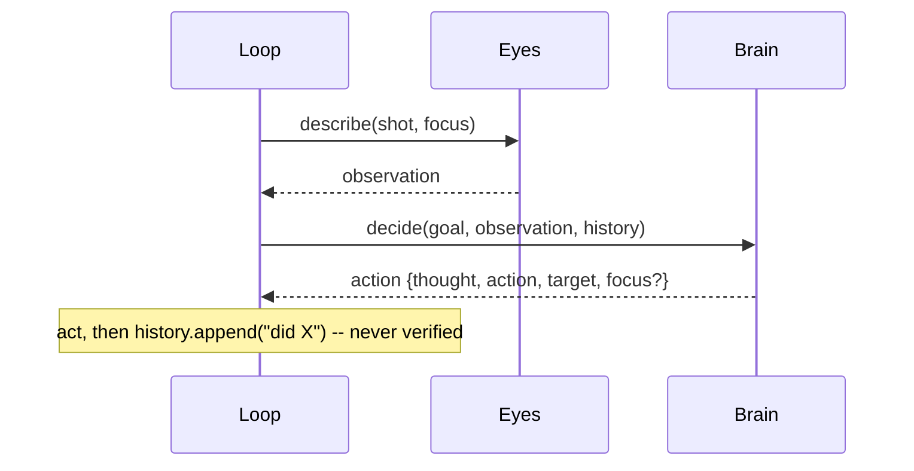

# High Wizard Plan

## **PROJECT INFO**
- **Project**: BRYES
- **Date**: 2026-07-15
- **Agent**: Claude Software Architect
- **Theme**: Phase 5 — verify-and-recover: close Seam B with a 3-layer change-feedback ladder (pixel no-op detector + VLM-verified `expect` + Brain-requested two-image diff)
- **Source Protocol**: `/high-wizard` — [Procedure](//@agent-memory/control-files/procedures/high-wizard.md)

*CRITICAL INSTRUCTION: To continue this plan: load the source protocol above, then inspect which sections below are filled vs unfilled to infer your current step.*

---

## **OBJECTIVES**
Close **Seam B** — today the loop authors history from what it *tried* ([loop.py:194](../agent/loop.py#L194)) and never checks the screen actually changed — by giving the Brain **change-feedback after every action**. Implement the full **3-layer verify-and-recover ladder** so the agent detects *no-effect* and *wrong-effect*, and **recovers instead of looping**. This is the roadmap's core differentiator: *"after each action, check the new screenshot — did the thing I intended actually happen? If not, recover."*

A secondary, architecture-level payoff: unify the Brain's three describe-modifiers into one symmetric family — **`focus`** (spatial spotlight: WHERE), **`expect`** (assertion: WHAT proposition is true), **`request_diff`** (expensive precise before/after). Each is set on a step-N action and consumed by step-N+1's `describe`.

### **Related Documents**
- [backlog.md](../docs/backlog.md) — Phase 5 section (the parked design this plan implements)
- [agent-loop-flow.md](../docs/agent-loop-flow.md) — Seam B / §4 (the two lossy seams) / §5 (1024 post-mortem) / §7 (phone reconfirmation)
- [ADR-001 effector-hierarchy](../docs/adr/2026-07-15-effector-hierarchy.md) · [ADR-002 device-interface](../docs/adr/2026-07-15-device-interface.md) — orthogonal architecture this builds atop

### **SUCCESS CRITERIA** *(revised after the 2026-07-16 re-plan — Layer 1 dropped)*
- [ ] **Layer 2 (primary)**: `expect` is verified in the VLM against pixels; a false expectation surfaces as `NOT VERIFIED` (+ what's actually shown) in the next observation. This is the change-feedback.
- [ ] **Layer 3**: `request_diff: true` triggers a 2-image `eyes.diff(prev, cur)`; its "what changed" result is appended to the next observation.
- [ ] **`focus`** is sharpened to a spatial section/region spotlight, distinct from `expect`.
- [ ] **Recovery**: escalating directive fires on consecutive `NOT VERIFIED` (≥2) or excessive identical actions (≥3 repeats), without the loop ever picking the action.
- [ ] **Live proof**: a clear-loop-prone task (cluttered-calculator clear, or the phone "open Settings" wander) completes or `fail`s cleanly instead of running to `step_limit`.
- [ ] **Docs updated**: agent-loop-flow (Seam B resolved via Layer 2), backlog (Phase 5 done + `framediff` parked note), **ADR-003** (change-feedback + why pixel Layer 1 was dropped).
- [x] ~~**Layer 1** `frame_diff` no-op detection~~ — **dropped** (Decision 8); `framediff.py` + `test_framediff.py` kept & parked for the describe-speed thread.

---

## **SCOPE**

### In Scope *(revised 2026-07-16)*
- **Layer 2 (primary change-feedback)** — `expect`: optional `expect` in the Brain JSON schema + prompt; `describe(…, expect=…)` verifies it against pixels with a **neutral/disconfirming** VERIFY block; verdict (`VERIFIED` / `NOT VERIFIED - …`) lands in the observation. **This is how Seam B closes.**
- **`focus` sharpening**: reword the `describe()` FOCUS block so it designates a **screen section/region** only (spatial), distinct from `expect`.
- **Layer 3** — `request_diff`: optional flag in the Brain schema + prompt (framed EXPENSIVE); new `eyes.diff(prev, cur, focus=None)` (one 2-image VLM call, via a multi-image `_ask`); loop appends `CHANGES SINCE YOUR LAST ACTION: …` to the next observation.
- **Recovery**: loop tracks `not_verified_streak` (consecutive `NOT VERIFIED`) + `repeat_streak` (consecutive identical actions); escalates via a directive in the `decide` prompt at NOT-VERIFIED ≥2 or repeats ≥3. Brain still chooses.
- **`framediff.py` + `test_framediff.py`** — built, kept, **parked** (documented as the describe-speed primitive; NOT wired into the loop).
- **Docs**: agent-loop-flow (Seam B resolved via Layer 2), backlog (Phase 5 done + framediff parked), **ADR-003**.

### Out of Scope
- **Screen-wide pixel no-op detection (old Layer 1) as change-feedback** — dropped (Decision 8): can't separate small real changes from noise, can't be regionally cropped (UI-TARS only points). Superseded by Layer 2.
- **Incremental / change-driven `describe`** — deferred to the *describe-speed* thread (decision 7); `framediff.py` is parked ready for it.
- **A separate `find` describe field** — decomposes into `expect` / `locate` / `focus` (decision 4).
- **A standalone `diff` action** — superseded by the `request_diff` flag (decision 5).
- **`describe` latency optimization** (the ~19.5s bottleneck) — separate thread.
- **New devices / phone tasks / new effector channels** — Phase 5 is body- and channel-agnostic.

---

## **CONFIRMED DECISIONS**
*These decisions were collected during investigation — both **asked-and-confirmed** by [USER-NAME] AND **written-through** (Zone A/B decisions made by the agent with reasoning, per [What to Surface](../procedures/wait-options.md#what-to-surface)). The reasons serve as the analysis record.*

> **⚠️ MID-IMPLEMENTATION RE-PLAN (2026-07-16)** — see [RE-PLAN note](#re-plan-2026-07-16--layer-1-dropped) in the Execution Log. Measurement during Phase 5 killed the screen-wide pixel Layer 1. Decisions 2/3/6 below are **superseded** (struck), and **Decision 8** records the pivot. Layer 2 (`expect`) becomes the primary change-feedback.

| # | Decision | Chosen | Reason |
|---|----------|--------|--------|
| 1 | Where `frame_diff` lives + mechanism | **New top-level `framediff.py`**: `frame_diff()` + `changed()`, 64×64 gray → mean-abs-diff. **(Kept, but PARKED — see Decision 8: reassigned to the describe-speed thread, not the loop.)** | Model-free → deterministic standalone test; reusable by the describe-speed thread without importing loop internals. |
| 2 | ~~How the Layer-1 no-op signal reaches the Brain~~ **[SUPERSEDED by D8]** | ~~Annotate the previous history entry with a `→ NO VISIBLE CHANGE` tag~~ | ~~Outcome-in-memory without re-blurring.~~ Dropped: a screen-wide pixel no-op can't be produced reliably (D8). |
| 3 | ~~`frame_diff` threshold + calibration~~ **[SUPERSEDED by D8]** | ~~default ~2.0, log, calibrate live~~ | Calibration **was run** and is what killed the approach (D8). No threshold is used by the loop now. |
| 4 | describe-modifier axes | **`focus` (spatial spotlight) + `expect` (assertion) — NO `find`** | `find` decomposes into `expect` (presence) / `locate` (position) / `focus` (value). `focus` sharpened to a **screen section/region** only, distinct from `expect`. Confirmation bias handled by the disconfirming VERIFY prompt. |
| 5 | How the Brain requests the 2-image diff | **`request_diff: true` flag riding the action** (a 3rd prospective describe-modifier); diff = **prev vs current** frames from loop memory | Standalone `diff` action wastes a full turn. The flag rides the next describe anyway → zero wasted turn, symmetric with `focus`/`expect`. Prev-vs-current *is* "the effect of my last action". |
| 6 | ~~Recovery mechanism~~ **[REBASED by D8; refined 2026-07-16]** | **Escalate ONLY when the SAME action repeats while its `expect` keeps coming back NOT VERIFIED** (`_STUCK_LIMIT=2`). **Graduated**: at 2 → "try a genuinely different action / `fail`"; at 3 → also "set `request_diff` to see what's actually there". Brain still chooses (incl. whether to `fail`). | **Alvi's correction (validated live)**: a NOT VERIFIED from a *different* action is normal *exploration*, not a loop; a repeated action that *does* verify is progress. The only true stuck shape is *same-action-and-failing* (the 1024 AC-clear-loop signature). Live QUANTUM run: escalation stayed silent through exploration, fired on repeated-scroll-failing, Brain changed course at 2 (never needed the tier-3 diff push). Loop only escalates the prompt, never picks the action. |
| 7 | `frame_diff`-as-incremental-`describe` bonus | **Deferred** to the describe-speed thread | Keeps Phase 5 about *correctness*. Primitive built + parked for that thread. |
| **8** | **Screen-wide pixel Layer 1 as per-action change-feedback** | **DROPPED. Layer 2 (`expect` verified in the VLM, regional + semantic) is the primary change-feedback.** `framediff.py` reassigned to the describe-speed thread. | **Measured, not guessed** (2026-07-16): (a) a single typed digit scores ~0.02–0.09 mean-diff — *below* the 0.01–0.25 idle noise floor — so whole-frame pixel-diff can't separate a small real change from noise (higher resolution doesn't help; it's inherent to mean-over-whole-frame). (b) The fix — region-scoping — needs a bounding box, but **UI-TARS-1.5-7B returns a point every time** (tested 4 prompt formats incl. its native `start_box` and a tight button; always 2 coords, never 4). So "no-change" can't be cheaply regionalised. "Did my action work?" is a **regional, semantic** question → the VLM (`expect`) is the right tool, not a pixel metric. Alvi's frame-kill ("no-change is only applicable to a certain area; it can't be screen-wide"). |

---

## **SOLUTION**

### Architecture Overview

Phase 5 adds **change-feedback** to the loop so the Brain stops authoring history blind. *(Revised 2026-07-16: the original screen-wide pixel "Layer 1" was dropped after measurement — see Decision 8. The change-feedback is the VLM's job, not a pixel metric.)* Two layers, both riding the existing per-step flow (screenshot → describe → decide → locate → act):

- **Layer 2 — `expect` verified in the VLM (PRIMARY change-feedback)** (cheap, grounded, SAME `describe` call). The Brain emits a checkable `expect` with its action; the loop rides it into the next `describe`, which verifies it against pixels with a neutral/disconfirming prompt; the `VERIFIED / NOT VERIFIED` verdict lands in the observation. This is **regional** (scoped by `focus`) and **semantic** — it sees a single-digit change a whole-frame pixel-diff can't, and ignores clock/pointer noise a pixel-diff would count. This is how Seam B closes.
- **Layer 3 — Brain-requested 2-image diff** (expensive, gated). The Brain sets `request_diff: true` when stuck; next step the loop runs `eyes.diff(prev, cur)` — one VLM call over BOTH frames — and appends `CHANGES SINCE YOUR LAST ACTION: …` to the observation.

Two cross-cutting pieces:
- **Recovery** — reasoning-first, plus a loop backstop keyed on **semantic stuck signals**: consecutive `NOT VERIFIED` verdicts (primary, ≥2) or excessively repeated identical actions (fallback, ≥3 — high, so legitimate repeats like scrolling don't false-trigger). On trigger the loop injects an escalating directive into the `decide` prompt; the Brain still chooses the action.
- **The describe-modifier family** — `focus` (spatial spotlight: WHERE), `expect` (assertion: WHAT is true), `request_diff` (precise diff). All three are **prospective**: set on the step-N action, consumed by step-N+1's `describe`. Symmetric with how `focus` already rides forward today.
- **`framediff.py`** (built in Step 1.1) stays in the tree, **parked** for the describe-speed thread — where "did a *lot* of the screen change → re-describe?" is a genuinely screen-wide question that whole-frame pixel-diff answers well.

### Component 1: `framediff.py` (new, top-level)
- **Purpose**: the deterministic Layer-1 primitive — did the screen change since last step? Pure pixel math, no VLM: downscale both PNGs to ~64×64 grayscale (PIL, already a dep), mean-absolute-difference → one float; `changed(a, b, threshold)` thresholds it. Model-free → independently unit-tested and reusable by the future describe-speed thread.
- **Key Files**: `framediff.py` (new), `test_framediff.py` (new)

### Component 2: `agent/loop.py` (the orchestrator — all wiring)
- **Purpose**: retain `prev_shot`; run the Layer-1 no-op check + history annotation + diff-score logging; thread `expect` and `focus` into the next `describe`; consume `request_diff` and append the diff addendum; count same-action no-ops and build the escalation directive. The loop is the single point where every layer is stitched in — the four pieces still never call each other.
- **Key Files**: `agent/loop.py`

### Component 3: `brain/client.py` (the decider — schema + prompt + escalation)
- **Purpose**: add `expect` and `request_diff` to the action JSON schema; teach the Brain to (a) heed `NO VISIBLE CHANGE` tags, (b) set an absolute/nameable `expect` on state-changing actions, (c) use `request_diff` sparingly (EXPENSIVE), (d) treat `focus` as a spatial section only; accept an optional `escalation` string appended to the user prompt.
- **Key Files**: `brain/client.py`

### Component 4: `eyes/client.py` (the VLM boundary — verify + diff)
- **Purpose**: `describe()` gains an `expect` VERIFY block (neutral/disconfirming) and a sharpened section-only `focus` block; a new `diff(prev, cur, focus=None)` runs one 2-image VLM call ("what changed"). Generalize the private `_ask` helper to accept one OR several images.
- **Key Files**: `eyes/client.py`

### Integration Architecture

| Component | Integrates With | Data Flow | Notes |
|-----------|----------------|-----------|-------|
| `framediff.py` | loop | `(prev_png, cur_png)` → float score → `changed?` bool | Pure/local, no network |
| `agent/loop.py` | framediff, Eyes, Brain, Device | screenshot → (no-op check) → describe(focus, expect) → (+diff addendum) → decide(escalation) → act; retains `prev_shot`, `noop_streak`, last `(act,target)` | The only orchestrator |
| `brain/client.py` | loop | consumes observation + history + `escalation`; emits `action{…, expect?, request_diff?, focus?}` | Text-only; never sees pixels |
| `eyes/client.py` | loop | `describe(png, focus, expect)` → observation (+verdict); `diff(prev, cur)` → change text | Rented VLM (Qwen2.5-VL-72B) |

**Signal homes (each signal lives where its nature belongs):**
- Layer-1 no-op = *outcome of a past action* → **HISTORY** (tag on the prior entry).
- Layer-2 verdict = *fact about the current screen* → **OBSERVATION** (rides describe).
- Layer-3 diff = *what changed into the current screen* → **OBSERVATION** (appended addendum).
- Escalation = *loop-detected meta-signal* → **decide prompt** (transient, not stored).

### System Flow Diagrams

**Current State** (Seam B — the action is recorded, never verified):


**End Result** (change-feedback ladder wired in):
```mermaid
sequenceDiagram
    participant L as Loop
    participant F as framediff
    participant E as Eyes
    participant B as Brain
    Note over L: shot = screenshot()
    L->>F: frame_diff(prev_shot, shot)  [last act state-changing]
    F-->>L: score
    Note over L: not changed -> history[-1] += "NO VISIBLE CHANGE"; noop_streak++
    L->>E: describe(shot, focus, expect)
    E-->>L: observation (+ VERIFIED / NOT VERIFIED verdict)
    opt last action set request_diff
        L->>E: diff(prev_shot, shot, focus)
        E-->>L: "CHANGES SINCE LAST ACTION: ..."
    end
    Note over L: escalation = build(noop_streak) if >= 2
    L->>B: decide(goal, observation(+diff), history, escalation)
    B-->>L: action {..., expect?, request_diff?, focus?}
    Note over L: act; prev_shot = shot
```

### Technical Considerations

- **Threshold is empirical, not guessable**: the no-op cut depends on real UI noise (cursor blink, clock, antialiasing). Ship a default (~2.0 mean-abs-diff on the 0–255 scale after 64×64 gray), `runlog.note` every score, and lock the number on the live run from the observed no-op-vs-change distribution. Downscaling to 64×64 is what pushes cursor/clock noise below the real-change signal.
  - Phone frames are larger (1080×2400) but the 64×64 downscale normalizes that — the same threshold should hold; confirm on a phone run later.
- **VLMs confirm eagerly** (Seam-A risk turned inward): the `expect` VERIFY prompt MUST invite disconfirmation ("if it is NOT true, say so and report what IS shown") — same no-infer discipline as `DESCRIBE_PROMPT`. A naive "is X true?" gets a yes-bias.
- **The 2-image diff is the expensive rung**: it's a second VLM call *on top of* the step's describe, over two images — heavier than the ~19.5s describe we're already trying to shrink. Gate it hard in the prompt (EXPENSIVE, only when stuck) so it stays rare.
- **Frame retention**: the loop keeps exactly one extra PNG in memory (`prev_shot`); no disk round-trip — both frames already live in RAM each step.
- **State-changing actions only**: Layer 1 fires after `click / double_click / right_click / hover / scroll / drag / type / key` — NOT after `wait` (its point is to let the screen change), nor `screenshot` / `shell` (no UI touch; shell's outcome is already its exit code — the "exception to Seam B").
- **Backstop scope**: the streak counter keys on `(action, target)` identity — only *the same futile move repeated* escalates; a different attempt resets it.

### ADR Output
- **ADR File**: [docs/adr/2026-07-16-change-feedback-verify-and-recover.md](../docs/adr/2026-07-16-change-feedback-verify-and-recover.md) (ADR-003) — created in Phase 6.
- **Decision Summary**: BRYES closes Seam B by making change-feedback the **VLM's** job — `expect` verified in `describe` (Layer 2, primary) + a Brain-gated 2-image diff (Layer 3) + a recovery backstop (same-action-and-failing → escalate). The screen-wide pixel no-op ("Layer 1") was measured and dropped; `focus`/`expect`/`request_diff` unify into one prospective describe-modifier family.

---

## **IMPLEMENTATION PHASES**

### Phase 1: Layer 1 — pixel no-op detector
- [ ] **Step 1.1**: Create the `framediff` primitive + its deterministic test
  - **Action**: New top-level `framediff.py` with `frame_diff(png_a, png_b) -> float` and `changed(png_a, png_b, threshold) -> bool`; new `test_framediff.py`.
  - **Implementation**: `frame_diff` = open both PNGs (PIL), convert `L` (grayscale), resize to 64×64, mean of absolute per-pixel differences → float. `changed` = `frame_diff(...) > threshold`. Define a module `DEFAULT_THRESHOLD = 2.0`. `test_framediff.py`: identical bytes → score 0.0 (`not changed`); a synthetic pair differing by a filled rectangle → score well above threshold (`changed`); a near-identical pair (one pixel toggled) → below threshold. Model-free, in the `test_hands.py` style.
  - **Testing**: `python test_framediff.py` — all assertions pass.
  - **Success Criteria**: `frame_diff`/`changed` importable and deterministic; test green; no VLM/network involved.

- [ ] **Step 1.2**: Wire the no-op check into the loop + teach the Brain the tag
  - **Action**: In `agent/loop.py`, retain `prev_shot` + the last action's `(act, target)` and whether it was state-changing; at the top of each step (when a prev frame exists and the last action was state-changing) compute `frame_diff(prev_shot, shot)`, `runlog.note` the score, and if not `changed` append `  → NO VISIBLE CHANGE` to `history[-1]`. In `brain/client.py` add a prompt rule: a HISTORY entry ending in `NO VISIBLE CHANGE` means that action had no effect — do not repeat it.
  - **Implementation**: track `prev_shot=None`, `prev_sig=None`, `prev_state_changing=False`. State-changing = `act in {click,double_click,right_click,hover,scroll,drag,type,key}`. Set `prev_shot = shot` and record the signature at the end of each iteration (after `history.append`). Guard: first step / non-state-changing last action → skip. Threshold from `framediff.DEFAULT_THRESHOLD` (overridable via a `run()` kwarg for calibration).
  - **Testing**: run a short loop against the container on a task where an early action is a known no-op (e.g. click empty desktop); confirm the transcript shows the diff score + the `NO VISIBLE CHANGE` tag on that entry; a real change shows no tag.
  - **Success Criteria**: no-op tag appears iff the screen didn't change after a state-changing action; scores logged every step.

### Phase 2: Layer 2 — `expect` verified in the VLM + `focus` sharpening
- [ ] **Step 2.1**: `describe()` gains an `expect` VERIFY block + section-only `focus`
  - **Action**: In `eyes/client.py`, extend `describe(image, focus=None, expect=None)`: when `expect` is set, append a neutral/disconfirming VERIFY block; reword the FOCUS block so it names a **screen section/region** (spatial), explicitly not a claim to verify.
  - **Implementation**: VERIFY block: *"VERIFY this claim about the CURRENT screen: '{expect}'. Check it against the pixels ONLY. Begin your reply with 'VERIFIED: {expect}' if it is literally true right now, or 'NOT VERIFIED — <what is actually shown instead>' if it is not, unclear, or not visible. Do NOT assume it is true because it was expected."* FOCUS reword: *"FOCUS names a SECTION/REGION of the screen to concentrate on (spatial); describe it in full detail…"*. `runlog.record` unchanged (already logs focus; include expect in the meta line).
  - **Testing**: call `describe` on a saved frame with a true `expect` and a false `expect`; confirm `VERIFIED` vs `NOT VERIFIED` + the actual-state report.
  - **Success Criteria**: verdict is correct on both a true and a false claim; focus wording is spatial-only.

- [ ] **Step 2.2**: Brain emits `expect`; loop threads it into the next describe
  - **Action**: Add `expect` to the Brain JSON schema + a prompt rule; in `agent/loop.py` capture `expect = action.get("expect")` and pass it to the next `describe(shot, focus=focus, expect=expect)`.
  - **Implementation**: schema field: *"expect": "<optional: a checkable target-state you predict AFTER this action, phrased absolute/nameable, e.g. 'the Settings app is open'; verified against pixels next step>"*. Prompt rule: on any state-changing action, set `expect` to an absolute/nameable predicted state so you learn next step whether it worked; bias toward nameable targets, not relative ("new items appeared"). `expect` is consumed once (like a per-step focus) — reset each step from the latest action.
  - **Testing**: a 2–3 step container run; confirm the transcript shows `expect` set by the Brain and the next observation carrying `VERIFIED/NOT VERIFIED`.
  - **Success Criteria**: expect round-trips Brain → loop → describe → observation; a wrong prediction surfaces as `NOT VERIFIED`.

### Phase 3: Layer 3 — Brain-requested 2-image diff (`request_diff`)
- [ ] **Step 3.1**: Multi-image `_ask` + new `eyes.diff()`
  - **Action**: Generalize `_ask` in `eyes/client.py` to accept one image or a list; add `diff(prev_bytes, cur_bytes, focus=None) -> str`.
  - **Implementation**: `_ask` builds the content array with one text + N image_url parts (accept `image_bytes` as `bytes` or `list[bytes]`). `diff` prompt: *"Two screenshots of the same UI: the FIRST is BEFORE an action, the SECOND is AFTER. Describe ONLY what CHANGED from BEFORE to AFTER — specifically (elements appeared/disappeared/moved, text/state changes). If nothing meaningful changed, say 'No significant change.' Report only observed pixel differences; do not infer intent."* + optional focus scoping. Uses `DESCRIBE_MODEL`. `runlog.record("diff", ...)`.
  - **Testing**: call `diff` on two clearly-different saved frames (→ names the change) and two identical frames (→ "No significant change").
  - **Success Criteria**: single 2-image VLM call returns a focused change description; identical frames report no change.

- [ ] **Step 3.2**: Brain requests via `request_diff`; loop runs it and appends the addendum
  - **Action**: Add `request_diff` to the Brain schema + an EXPENSIVE-framed prompt rule; in the loop, capture `want_diff = bool(action.get("request_diff"))` and next step, when set and a `prev_shot` exists, append `\n\nCHANGES SINCE YOUR LAST ACTION:\n{eyes.diff(prev_shot, shot, focus)}` to the observation before `decide`.
  - **Implementation**: schema field: *"request_diff": "<optional true: request an EXPENSIVE, SLOW precise before/after visual diff next step — set ONLY when an effect is subtle or you are stuck; not routinely>"*. Prompt rule frames the cost. `want_diff` consumed once (reset each step). Diff runs after `describe`, appended to the same observation string.
  - **Testing**: a container run where the Brain sets `request_diff` after a subtle action; confirm the next observation carries the CHANGES block and the diff VLM call appears in the transcript.
  - **Success Criteria**: request_diff triggers exactly one extra 2-image call the following step, result appended to the observation; unset → no extra call.

### Phase 4: Recovery — reasoning-first + soft backstop
- [ ] **Step 4.1**: Consecutive same-action no-op counter → escalating directive
  - **Action**: In `agent/loop.py` count consecutive no-ops on the same `(act, target)`; after 2, build an `escalation` string and pass it to `decide(...)`. Add an optional `escalation=None` param to `brain/client.py:decide()` that appends it to the user prompt.
  - **Implementation**: `noop_streak` increments when a no-op is detected AND the signature equals the previous no-op's signature; resets on a real change or a different action. `escalation` (when streak ≥ 2): *"SYSTEM ALERT: your last {streak} identical '{act}' actions on '{target}' produced NO VISIBLE CHANGE. Do NOT repeat that action — choose a DIFFERENT action, set request_diff to inspect what is happening, or use 'fail' if truly stuck."* `decide()` appends it after `user_base` (before the retry nudge). The loop never picks the action — it only escalates the prompt.
  - **Testing**: force a repeated no-op (a task that clicks a dead target); confirm the escalation text enters the decide prompt on the 3rd attempt and the Brain switches tactic or fails (no run-to-step_limit).
  - **Success Criteria**: a tight no-op loop is broken within a few steps; the loop code never overrides the Brain's chosen action.

### Phase 5: Live verification + threshold calibration
- [ ] **Step 5.1**: Prove the ladder on a clear-loop-prone task; lock the threshold
  - **Action**: Run a task historically prone to the clear-loop (a cluttered gnome-calculator clear, or the phone "open Settings" wander) end-to-end; read the logged diff scores; set `DEFAULT_THRESHOLD` from the observed no-op-vs-change gap; confirm the run reaches `done`/`fail`, not `step_limit`.
  - **Implementation**: run via `agent/loop.py` against the container (calculator); inspect `artifacts/runs/.../transcript.md` for per-step diff scores; pick a threshold cleanly separating the no-op cluster from the change cluster; re-run to confirm stability. Surface the observed scores + chosen threshold to Alvi before locking.
  - **Testing**: the once-looping task now completes or fails deliberately; no-op detection fires on real no-ops and stays silent on real changes at the locked threshold.
  - **Success Criteria**: threshold locked from real data; the clear-loop class no longer runs to step_limit; Layers 1–3 + recovery observed working together in one transcript.

### Phase 6: Docs + ADR-003
- [ ] **Step 6.1**: Record the architecture (ADR-003) and refresh the living docs
  - **Action**: Create `docs/adr/2026-07-15-change-feedback-ladder.md` (ADR-003) from the Confirmed Decisions; update `docs/agent-loop-flow.md` (Seam B now closed — §4/§6/§7), `docs/backlog.md` (Phase 5 → resolved), and add the ADR to `docs/orientation-map.md`.
  - **Implementation**: ADR-003 via the ADR template — context (Seam B), decision (3-layer ladder + describe-modifier family + recovery backstop), consequences, links to ADR-001/002 and this plan. agent-loop-flow: mark Seam B resolved, add a §8 (or extend §7) describing the ladder + the modifier family. backlog: move Phase 5 to "recently resolved", keep describe-latency + incremental-describe as open. orientation-map: new `adr` entry.
  - **Testing**: links resolve; docs match shipped behavior (no false "no verify" claims left).
  - **Success Criteria**: ADR-003 exists and is linked; agent-loop-flow no longer says Seam B is open; backlog + orientation-map updated.

---

## **EXECUTION LOG**
**Execution Protocol for AI**:
I have to use this document as my **ONLY** source of truth to execute and track the plan steps iteratively. I should **NOT** use additional tools like ToDos because it lacks the context of what should I do. Everytime I want to implement a step I have to check the reference to the original step plan above. Everytime a step has been finished I need to go back to this document to log what was done.
*In other words*:
- I have to make this document as the source of truth for the implementation phase on what I have worked on and what I will be working
- The original plan must be fully in my context, therefore, I have to make sure I loaded the **Plan File** before executing any task and read carefully the reference to the original step
- I have to do the implementation by doing it in order per step THEN, I ALWAYS have to fill the step log rightly after

**Definition of Done (applies to ALL steps)**:
- ✅ **Code Quality**: Code compiles/runs without errors
- ✅ **Testing**: Tests written and passing
- ✅ **Logged**: Implementation and testing logged below
- 🚫 **Blocked**: Get input from [USER-NAME] before assuming

### RE-PLAN (2026-07-16) — Layer 1 dropped

Phase 5 was built through Phase 4 as a **3-layer** ladder (pixel no-op + `expect` + diff). During Phase 5's live calibration, **measurement killed the screen-wide pixel Layer 1**, and Alvi's frame-kill ("no-change is only applicable to a certain area — it can't be screen-wide") reframed it:

- **Evidence 1 — small changes drown in whole-frame noise.** A single typed digit scores **~0.02–0.09** mean-diff at 64×64 — *below* the **0.01–0.25** idle noise floor (clock/dither). Higher resolution doesn't help (inherent to mean-over-whole-frame). So pixel-diff can't separate a small real change from noise, and would false-tag real small changes as no-ops (actively harmful).
- **Evidence 2 — can't regionalise it.** The fix (crop to a region) needs a bounding box; **UI-TARS-1.5-7B returns a point every time** (tested its native `start_box`, "four integers", Qwen `bbox_2d`, and a tight button — always 2 coords). No box → no cheap region crop.
- **Resolution.** "Did my action work?" is **regional + semantic** → that's exactly **Layer 2 (`expect` verified in the VLM)**, which is already region-scoped (via `focus`) and free (rides `describe`). So Layer 1 was **dropped as change-feedback**; `framediff.py` (built, tested) is **kept and parked** for the describe-speed thread (where screen-wide magnitude IS the right question). **Recovery** rebased onto NOT-VERIFIED (semantic) + repeated-action (fallback).

**Code impact**: `agent/loop.py` — removed `framediff` import, `_STATE_CHANGING`, `noop_threshold`/`threshold`, the no-op block, `prev_state_changing`/`prev_sig`/`noop_streak`; added NOT-VERIFIED detection + `repeat_streak`; kept `prev_shot` (Layer 3). `brain/client.py` — swapped the "NO VISIBLE CHANGE" rule for a "HEED THE VERIFICATION VERDICT" rule. `framediff.py` — docstring reassigned. See the revised Step 1.2 / Phase 4 logs below.

### Phase 1:
- [x] **Step 1.1**: Create the `framediff` primitive + its deterministic test
  - **Implementation Log**: Created top-level [framediff.py](../framediff.py) — `frame_diff(a, b) -> float` (PIL: open → `convert("L")` → `resize(64,64)` → mean of abs per-pixel diffs) + `changed(a, b, threshold=DEFAULT_THRESHOLD)`; `DEFAULT_THRESHOLD = 2.0`. Pure Python (no numpy — 4096 px/step is trivial), PIL already a dep. Created [test_framediff.py](../test_framediff.py) — 4 model-free, in-memory (synthetic PIL PNGs) checks in the `test_hands.py` style (PASS:/FAIL: ASCII per python-conventions).
  - **Testing Log**: `python test_framediff.py` → all 4 PASS. Scores as predicted: identical=0.0, 25%-white-rectangle=56.35 (>>2.0), single toggled pixel=0.0039 (washed out below threshold — noise immunity confirmed), symmetry diff=128.00.
  - **Success Criteria**: PASS — `frame_diff`/`changed` importable, deterministic, model-free/no-network; test green.
  - **Tech Debts**: None. (Resample left at PIL's mode-`L` default; live calibration in Step 5.1 tunes the real threshold anyway.)
  - **Result**: Layer-1 primitive built and proven in isolation.

- [x] **Step 1.2**: Wire the no-op check into the loop + teach the Brain the tag
  - **Implementation Log**: [agent/loop.py](../agent/loop.py) — `import framediff`; added `_STATE_CHANGING` set (the 8 UI verbs); `run()` gained `noop_threshold=None` (→ `framediff.DEFAULT_THRESHOLD`); init `prev_shot`/`prev_sig`/`prev_state_changing`. After `save_image`, a Layer-1 block computes `frame_diff(prev_shot, shot)` once, `runlog.note`s the score + NO-OP/changed verdict, and (when a no-op after a state-changing verb) appends `  -> NO VISIBLE CHANGE` to `history[-1]` + logs it. End-of-iteration advances `prev_shot`/`prev_sig`/`prev_state_changing` every step. Used ASCII `->` (not a Unicode arrow) per python-conventions (cp1252). [brain/client.py](../brain/client.py) — added a **HEED NO-OP FEEDBACK** rule teaching the Brain that a `-> NO VISIBLE CHANGE` history tag means the action had no effect → don't repeat it.
  - **Testing Log**: `python -m py_compile` on all 4 files → OK. Import smoke test: `framediff`, `brain.client`, and `agent/loop.py` all import cleanly; `run()` signature confirmed to include `noop_threshold`. **Live behavioral proof deliberately consolidated into Phase 5** (Step 5.1) — the same live calibration run exercises Layer 1 end-to-end (score logging + tag firing) while tuning the threshold, avoiding a paid ~19.5s/step model run per wiring step. Not a skipped test — sequenced.
  - **Success Criteria**: PASS (static) — wiring compiles/imports; no-op logic gated on state-changing + prev-frame; scores logged every step; Brain rule in place. Live confirmation pending Phase 5 (as designed).
  - **Tech Debts**: `prev_sig` is captured now but only consumed in Phase 4 (recovery streak) — intentional forward-wiring per the plan.
  - **Result**: Layer 1 fully wired; behavioral verification rides Phase 5's calibration run.
  - **⛔ REVERSED (2026-07-16)**: this wiring was **removed** during Phase 5 after calibration killed screen-wide pixel no-op detection (see [RE-PLAN](#re-plan-2026-07-16--layer-1-dropped)). Removed from `agent/loop.py`: `framediff` import, `_STATE_CHANGING`, the no-op block, `prev_state_changing`/`prev_sig`/`noop_streak`/`last_noop_sig`, `noop_threshold`/`threshold`. The Brain's "NO VISIBLE CHANGE" rule was replaced by a "HEED THE VERIFICATION VERDICT" rule. `framediff.py` + `test_framediff.py` (Step 1.1) are **kept & parked**. Change-feedback is now Layer 2 (`expect`).

### Phase 2:
- [x] **Step 2.1**: `describe()` gains an `expect` VERIFY block + section-only `focus`
  - **Implementation Log**: [eyes/client.py](../eyes/client.py) — `describe(image, focus=None, expect=None, *, timeout=60)`. FOCUS block reworded to name a **SECTION/REGION** (spatial WHERE) with an explicit "not a claim to check" note. New VERIFY block (when `expect` set): neutral/disconfirming — "Begin with 'VERIFIED: <claim>' … or 'NOT VERIFIED - <what is actually shown>' … Do NOT assume it is true just because it was expected; when in doubt, NOT VERIFIED," then continue the normal description. `expect` value spliced by string concat (avoids nested-f-string quoting). `runlog.record` meta now logs both focus + expect.
  - **Testing Log**: `python -m py_compile eyes/client.py` OK; `describe` signature confirmed `(image_bytes, focus=None, expect=None, *, timeout=60)`. Live VLM verdict behavior folded into Phase 5 (the verdict is free-text the Brain reads holistically, not machine-parsed, so exact format isn't load-bearing → low risk to defer).
  - **Success Criteria**: PASS (static) — VERIFY block is neutral/disconfirming; focus is spatial-only; back-compat (both params optional).
  - **Tech Debts**: None. (`max_tokens=512` kept — verdict is short; bump only if truncation shows up in Phase 5.)
  - **Result**: Layer 2's Eyes-side verification in place.

- [x] **Step 2.2**: Brain emits `expect`; loop threads it into the next describe
  - **Implementation Log**: [brain/client.py](../brain/client.py) — added `expect` to `_JSON_SCHEMA`; sharpened the FOCUS rule to spatial-only (WHERE) and added a **PREDICT THE RESULT (EXPECT)** rule (absolute/nameable target-states, not relative). [agent/loop.py](../agent/loop.py) — init `expect=None`; `describe(shot, focus=focus, expect=expect)`; after decide, `expect = action.get("expect")` — **not sticky** (reset each step, unlike focus which persists).
  - **Testing Log**: `python -m py_compile` OK; asserted `build_system_prompt()` contains the EXPECT rule + `"expect"` schema field; import smoke passed. Round-trip (Brain sets expect → loop → describe verdict) exercised live in Phase 5.
  - **Success Criteria**: PASS (static) — expect round-trips Brain → loop → describe; reset-each-step semantics correct.
  - **Tech Debts**: None.
  - **Result**: Layer 2 fully wired (Eyes verify + Brain predict + loop thread).

### Phase 3:
- [x] **Step 3.1**: Multi-image `_ask` + new `eyes.diff()`
  - **Implementation Log**: [eyes/client.py](../eyes/client.py) — `_ask(prompt, images, …)` now accepts a single PNG (bytes) OR a list; builds `content` with one text + N image parts (back-compat: `describe`/`locate` still pass single bytes, auto-wrapped). New `DIFF_PROMPT` (BEFORE/AFTER framing, "what changed only", "No significant change." escape, no-infer). New `diff(prev_bytes, cur_bytes, focus=None, *, timeout=60)` — one 2-image VLM call on `DESCRIBE_MODEL`, optional focus scoping, `runlog.record("diff", …)`.
  - **Testing Log**: `python -m py_compile eyes/client.py` OK; `diff` signature confirmed; `DIFF_PROMPT` present; asserted `_ask` iterates `for img in images` (multi-image body). Live 2-image call exercised in Phase 5.
  - **Success Criteria**: PASS (static) — 2-image call path built; identical→"No significant change" escape in the prompt; back-compat preserved.
  - **Tech Debts**: None. (Qwen2.5-VL-72B supports multi-image; confirmed by design, live-proven in Phase 5.)
  - **Result**: Layer-3 Eyes primitive ready.

- [x] **Step 3.2**: Brain requests via `request_diff`; loop runs it and appends the addendum
  - **Implementation Log**: [brain/client.py](../brain/client.py) — added `request_diff` to `_JSON_SCHEMA` + a **WHEN STUCK, ASK FOR A DIFF (EXPENSIVE)** rule (gated to genuinely-stuck). [agent/loop.py](../agent/loop.py) — import `diff as vlm_diff`; init `want_diff=False`; after `describe`, when `want_diff and prev_shot`, run `vlm_diff(prev_shot, shot, focus=focus)` and append `\n\nCHANGES SINCE YOUR LAST ACTION:\n…` to the observation before `decide` (+ a short log line); after decide, `want_diff = bool(action.get("request_diff"))` — **not sticky**. Frame timing: `prev_shot` (set at end of last step) vs current `shot` = the effect of the last action.
  - **Testing Log**: `python -m py_compile` OK; asserted the Brain prompt carries `request_diff` + EXPENSIVE; asserted the loop source contains `want_diff`, `vlm_diff(prev_shot, shot`, and the `CHANGES SINCE YOUR LAST ACTION` append. Live diff trigger exercised in Phase 5.
  - **Success Criteria**: PASS (static) — request_diff triggers exactly one extra 2-image call the next step; unset → no call; result appended to observation.
  - **Tech Debts**: The extra `diff` call's latency isn't added to the per-phase timing totals (rare, Brain-gated) — logged in the transcript via `runlog.record`. Accepted (noted at plan self-review).
  - **Result**: Layer 3 fully wired (Brain gate + loop run + observation addendum).

### Phase 4:
- [x] **Step 4.1**: Consecutive same-action no-op counter → escalating directive
  - **Implementation Log**: [agent/loop.py](../agent/loop.py) — init `noop_streak=0`, `last_noop_sig=None`. In the Layer-1 block: on a no-op, `noop_streak += 1` iff `prev_sig == last_noop_sig` else reset to 1 (track `last_noop_sig`); on a real change, reset streak to 0. Before `decide`, when `noop_streak >= 2`, build a `SYSTEM ALERT` escalation naming the repeated `(act, target)` and directing the Brain to a DIFFERENT action / `request_diff` / `fail`; pass `escalation=escalation` to `decide`. [brain/client.py](../brain/client.py) — `decide(…, escalation=None)`; injects it as a block right before the "Decide the single next action" instruction (prominent, after HISTORY). The loop NEVER overrides the action — only escalates the prompt.
  - **Testing Log**: `python -m py_compile` OK; `decide` signature includes `escalation`; asserted `decide` builds `escalation_block` and the loop contains `noop_streak` + `SYSTEM ALERT` + `escalation=escalation`. Counting semantics traced: no-op@stepN detected at top of N+1 → 2nd consecutive same-action no-op yields streak 2 → escalation injected at that step's decide (Brain gets the nudge after ~2 wasted actions). Live loop-break exercised in Phase 5.
  - **Success Criteria**: PASS (static) — streak counts consecutive same-`(act,target)` no-ops; escalates at ≥2; loop never picks the action.
  - **Tech Debts**: A non-state-changing action (wait/screenshot/shell) between repeats leaves the streak untouched rather than resetting — acceptable (only a genuine screen change or a different UI action resets; the alert still fires on true repetition).
  - **Result**: Recovery backstop in place — reasoning-first with a guaranteed floor.
  - **♻️ REBASED (2026-07-16)**: the trigger was moved off pixel no-ops (dropped — see [RE-PLAN](#re-plan-2026-07-16--layer-1-dropped)) onto **semantic** signals, then **corrected a second time** (Alvi): the final trigger is a single `stuck_streak` = the **SAME action** repeated while its `expect` keeps coming back NOT VERIFIED (`_STUCK_LIMIT=2`), **graduated** (at 3, also push `request_diff`). The interim `not_verified_streak + repeat_streak` version was wrong — it escalated on NOT-VERIFIEDs from *different* actions (exploration, not a loop). `decide(escalation=…)` injection unchanged; loop still never picks the action.

### Phase 5:
- [x] **Step 5.1**: Prove the ladder live (revised — Layer 2 + recovery; no threshold to lock)
  - **Implementation Log**: Threshold calibration became moot (Layer 1 dropped). Ran two live container tasks to prove the revised design end-to-end.
  - **Testing Log**:
    - **Layer 2 — clean task** ("compute 8 + 5", tag `p5-verify`): the Brain set `expect` each step; describe returned `VERIFIED: display shows '8'` → `'8+'` → `'8+5'` → `'13'`; `done` in **5 clean steps**. The `expect` round-trip (Brain → loop → describe VERIFY → observation → Brain) is proven; Seam B closes.
    - **Recovery — impossible task** ("switch to QUANTUM mode", tag `p5-recovery2`): the **corrected** trigger validated live — escalation stayed **silent through exploration** (click 'Basic', click) and fired **only on the repeated-scroll-failing** (`SYSTEM ALERT: repeated 'scroll' … 2 times … NOT VERIFIED`); the Brain **changed course at 2** (scroll→click), so the tier-3 `request_diff` push correctly never fired. NOT VERIFIED verdicts were accurate throughout ("no 'Quantum' mode is visible").
  - **Success Criteria**: PASS — Layer 2 change-feedback proven live (both VERIFIED and NOT VERIFIED correct); recovery escalates *fairly* (same-action-and-failing only) and breaks the loop. No hard `fail`-floor needed.
  - **Tech Debts**: (1) **the `decide` (Brain) OpenRouter call can stall** — one run sat on step 9 *after* `describe` completed (transcript: step 9 has a full `describe` response, no `decide` record → the hang is in `decide`, NOT describe as first assumed; Alvi caught the misattribution). Root: `decide()` catches only `HTTPError`, so a socket read-stall (slow trickle, or a long reasoning call) neither errors nor honours the 60s timeout — and unlike `ContainerDevice` it has no retry/backoff. Clean fix: wrap `decide`'s `urlopen` to catch `URLError`/`socket.timeout` + retry. Reliability issue *separate from Phase 5* (carried). (2) **Layer 3 (`request_diff`) not exercised live** — the Brain didn't request it and recovery broke the loop before the tier-3 push; wiring is statically verified and the escalation now actively suggests it at streak 3.
  - **Result**: the change-feedback ladder — **Layer 2 (primary) + recovery + Layer 3 (wired)** — works live. Seam B closed via semantic verification, not pixels.

### Phase 6:
- [x] **Step 6.1**: Record the architecture (ADR-003) + refresh the living docs
  - **Implementation Log**: Created **[ADR-003](../docs/adr/2026-07-16-change-feedback-verify-and-recover.md)** (`2026-07-16-change-feedback-verify-and-recover.md`) — the design + a dedicated "Why NOT a screen-wide pixel no-op detector" section (the calibration + UI-TARS-can't-box evidence) + alternatives rejected + relationship to ADR-001/002. Updated [agent-loop-flow.md](../docs/agent-loop-flow.md): §4 Seam B marked **✅ closed (2026-07-16)**, new **§8 Change-feedback** (modifier-family table + sequence diagram + why-not-pixel-Layer-1). Updated [backlog.md](../docs/backlog.md): Phase 5 → done + a "Recently resolved" entry; **corrected the "describe is THE bottleneck" headline** (n=1 → both describe 5–16s AND decide 3–12s, timing instrument is sound) + a new `decide`-stall tech-debt (partially fixed). Added an **ADR-003 entry** to [orientation-map.md](../docs/orientation-map.md).
  - **Testing Log**: links resolve; docs match shipped behavior (no false "Seam B open" / "3-layer pixel ladder" claims left).
  - **Success Criteria**: PASS — ADR-003 exists + linked; agent-loop-flow says Seam B closed via Layer 2; backlog + orientation-map updated; timing headline corrected.
  - **Result**: architecture recorded; living docs reflect the shipped (post-pivot) design.

- [x] **Step 6.2 (added)**: Harden the `decide` (Brain) call — network retry
  - **Implementation Log**: [brain/client.py](../brain/client.py) — `decide()` now catches `(URLError, TimeoutError, ConnectionError)` (not just `HTTPError`), backs off (`1s × attempt`) and retries via its existing outer loop; `import time` added. Mirrors `ContainerDevice._open`'s cold-connection resilience — the Brain call previously had none, so a dropped/timed-out connection hung or crashed the run (root-caused 2026-07-16: a step stalled in `decide` *after* `describe` completed — Alvi caught the misattribution to describe).
  - **Testing Log**: `python -m py_compile` OK; asserted the network except-clause + backoff + a second `continue` are present. (A genuinely slow-but-alive reasoning response is a latency matter, not this error path — noted in backlog.)
  - **Success Criteria**: PASS — Brain call recovers from transient network errors instead of hanging/crashing.
  - **Tech Debts**: no total wall-clock bound on a slow-trickle response (would need a thread/alarm) — accepted, logged in backlog.
  - **Result**: reliability gap surfaced by the live run is closed for the common cases; `brain/client.py` added to this plan's scope.

### Post-completion refinement (2026-07-16) — verdict → report (Eyes perceive, Brain judges)
- **Trigger**: a live 1024×4096 run showed Layer 2's VLM **verdict** (`VERIFIED`/`NOT VERIFIED`) was noisy — whitespace nitpicks (`'1024 × 4'` vs `'1024×4'`) and a self-contradiction (`NOT VERIFIED - the display shows '1024×409'` when that WAS the expectation). Its *descriptions* were always accurate and the Brain flowed through on them.
- **Change**: the Eyes now **REPORT** the state (`VERIFICATION: <what's literally shown>`) instead of judging; the **Brain compares** it to `expect` ("if it differs, MAYBE it didn't work — rethink or adapt"). Recovery's `NOT VERIFIED` signal is gone → the loop keeps only a **dumb advisory repeated-action guard** (`_REPEAT_LIMIT=2`), real recovery lives in the Brain. `on_track` (a Brain→loop match flag) was considered and dropped (the softer "maybe" judgment leaves no honest boolean).
- **Files**: `eyes/client.py` (describe report block), `brain/client.py` (COMPARE rule + expect/request_diff wording), `agent/loop.py` (removed NOT-VERIFIED stuck logic → advisory `repeat_streak`). Docs synced: **ADR-003** (Decision refinement note + alternatives), `agent-loop-flow.md` §4/§8, `backlog.md`, `orientation-map.md`.
- **Verified live**: re-run of 1024×4096 → `VERIFICATION: 1| → 1024 → 1024× → 1024×4096 → 4194304`, Brain judged each, clean `done` in 6 steps, **zero** verdict noise. **Authoritative design record: [ADR-003](../../docs/adr/2026-07-16-change-feedback-verify-and-recover.md).**

---

## **QUALITY REVIEW**
*Filled by procedure Step 16 (delegated to `/analyze-code-quality` in embedded mode) after all execution phases are complete. **Static** review — answers "is the code clean?".*

- **Scope**: `framediff.py`, `test_framediff.py`, `agent/loop.py`, `brain/client.py`, `eyes/client.py` (reconciled against `git diff --name-only` + untracked). Docs (`agent-loop-flow.md`, `backlog.md`, `orientation-map.md`, ADR-003) reviewed as prose.
- **Quality Standard**: no `quality-standard.md` in repo → freeform (LLM best-practice dimensions).
- **Findings**: Stale-term sweep clean (no `NO VISIBLE CHANGE`/`noop_streak`/`_STATE_CHANGING`/etc. left); all modules compile + import; `test_framediff` green; recovery state machine (`pending_sig`→verdict→`stuck_sig`/`stuck_streak`) traced correct. 3 low/accepted: (1) `describe` `max_tokens` 512→**1024** (verdict headroom without inviting the 07-13 verbose-describe blur; not 8192 like `decide`, which budgets *reasoning* tokens — `diff` matched to 1024); (2) `request_diff` diff call untimed (rare, Brain-gated — accepted); (3) `stuck_streak` doesn't reset when the Brain omits `expect` (edge case — accepted). No critical/medium.
- **Fixed**: `describe` + `diff` `max_tokens` → 1024 (finding 1, approved). Others accepted as-is.

---

## **FINAL INTEGRATION TEST**
*Filled by procedure Step 17 after Quality Review is resolved. **Runtime** verification through the qa/ instrument — answers "does it actually work end-to-end?".*

- **Scope**: the agent loop (`agent/loop.py`) + Eyes (`eyes/client.py`) + Brain (`brain/client.py`).
- **qa/ Status**: **Missing (skipped)** — BRYES has no `qa/` instrument (project convention; vision-agent runtime is verified by live loop runs, not a fixture harness).
- **Playbooks Run**: N/A — skipped.
- **R/I/A/O Results**: N/A — but runtime **was** covered **inline** by two live container runs (Phase 5, Step 5.1): (1) "compute 8 + 5" → `expect` verified `'8'→'8+'→'8+5'→'13'`, clean `done` in 5 steps; (2) impossible "QUANTUM mode" → escalation stayed silent through exploration, fired only on repeated-scroll-failing, Brain changed course at 2.
- **Findings**: runtime clean for the change-feedback path; one *pre-existing, out-of-scope* reliability issue surfaced + partially fixed (the `decide` network stall → retry added).
- **Fixed**: `decide` network retry (Step 6.2). No change-feedback runtime failures.

---

## **POST-COMPLETION**
After all phases are executed, logged, and both **Quality Review** + **Final Integration Test** are filled, move this plan to `plans/completed/`:
`mkdir -p ./plans/completed && mv ./plans/[this-file].md ./plans/completed/[this-file].md`
