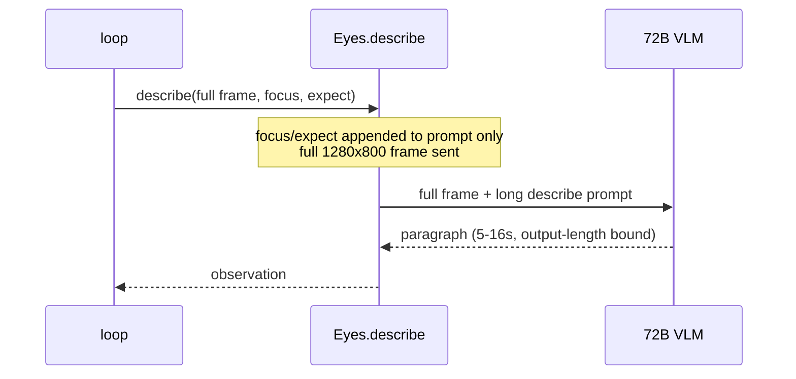
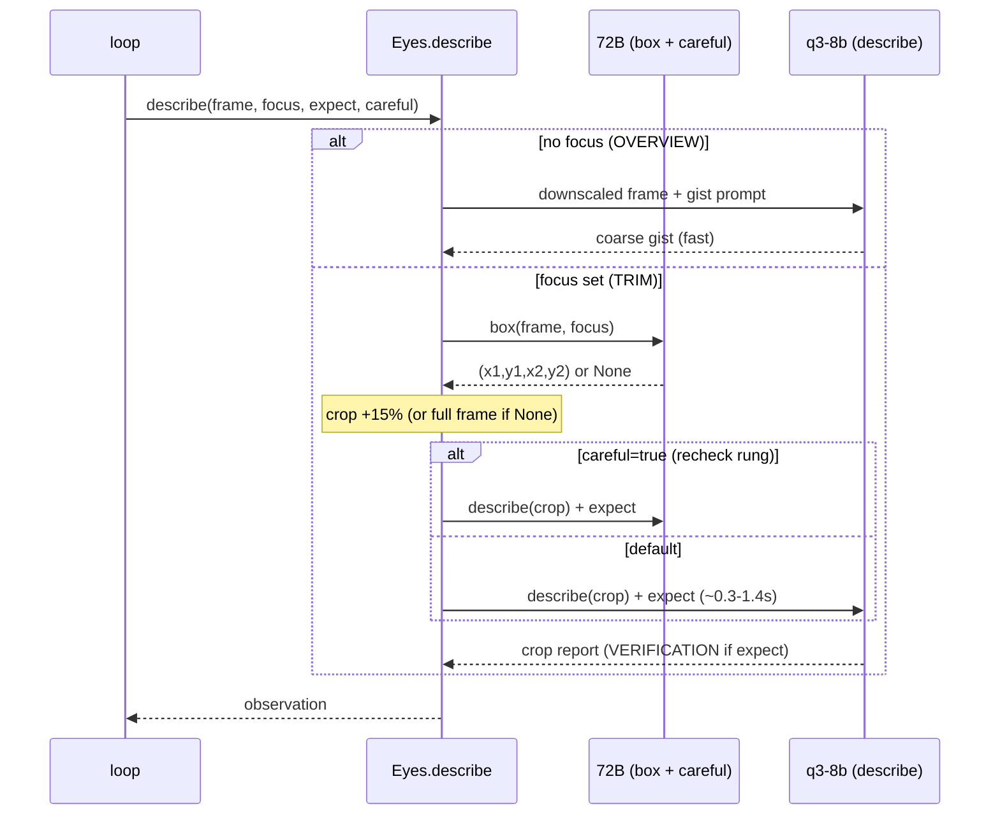

# High Wizard Plan

## **PROJECT INFO**
- **Project**: BRYES
- **Date**: 2026-07-16
- **Agent**: Claude Software Architect
- **Theme**: Two-mode foveal describe + trim — cut describe latency by attacking output length (overview-gist downscaled + focus-trim crop), boxer=72B, crop-describe=qwen3-vl-8b, with a 72B escalation ladder. Encodes the session's bake-off findings as ADR-004.
- **Source Protocol**: `/high-wizard` — [Procedure](//@agent-memory/control-files/procedures/high-wizard.md)

*CRITICAL INSTRUCTION: To continue this plan: load the source protocol above, then inspect which sections below are filled vs unfilled to infer your current step.*

---

## **OBJECTIVES**
Cut BRYES's per-step `describe` latency (currently 5–16s — the #1 tech debt) by attacking its **real driver: output length**, not model or image size (proven this session — 72B *boxes* a frame in ~1.5s but *describes* it in 5–16s, same model, same image). Give the Eyes two describe modes modeled on **foveal vision**: a cheap downscaled **OVERVIEW** gist when unfocused, and a sharp **TRIM** (box → crop → describe) when the Brain focuses — dropping focused-describe to ~0.3–1.4s (~30× vs the 10.7s full path) with faithfulness *preserved* (validated on hard crops incl. confab traps + `Rp759` vs struck `Rp799`). Make 72B the **authoritative-Eyes escalation**, not the default describer. Encode the bake-off as **ADR-004**.

### **Related Documents**
- [ADR-003 change-feedback / verify-and-recover](../docs/adr/2026-07-16-change-feedback-verify-and-recover.md) — the escalation ladder extends this
- [agent-loop-flow.md](../docs/agent-loop-flow.md) / [architecture-overview.md](../docs/architecture-overview.md) / [backlog.md](../docs/backlog.md) — docs to update
- Bake-off evidence: `artifacts/bakeoff/` (boxprobe, test3/test5 crop-describe, hard-crop montages)

### **SUCCESS CRITERIA**
- [ ] **Overview mode**: unfocused `describe` = downscaled full frame (start 0.5 → 640×400, calibrated) + positive-framed gist prompt via q3-8b
- [ ] **Trim mode**: `describe(focus=…)` runs 72B `box()` → crop (+15%) → q3-8b describes the crop; `expect` verification rides the crop
- [ ] **`box()`** on 72B, coordinate-convention-robust; validated at container res **and ~4M px (2560×1600)**
- [ ] **Escalation**: new Brain `recheck` field → 72B re-read on expect-mismatch; ladder `q3-8b → recheck → request_diff` intact
- [ ] Thinking **off** on all describe calls; default describe model = q3-8b; `expect` requires `focus` (Brain prompt enforces)
- [ ] Loop + Brain prompt updated; deterministic regression test for `box()` + describe modes green
- [ ] Docs updated + **ADR-004** written

---

## **SCOPE**

### In Scope
- **`eyes/client.py`**: two-mode `describe()` (overview vs trim), new `box()` (72B, coordinate-robust), model reshuffle (`DESCRIBE_MODEL`→q3-8b, new `BOX_MODEL`→72B), thinking off, OVERVIEW + CROP prompts, 15% crop padding
- **`agent/loop.py`**: describe-mode wiring (unchanged call site), `recheck` handling (one-step 72B override)
- **`brain/client.py`**: `expect`-requires-`focus` rule, new `recheck` field + prompt guidance, ladder wording
- **`box()` validation** at normal (1280×800) **and ~4M px (2560×1600)** container resolution — resolves the coordinate-convention question
- **Overview calibration** (downscale factor + prompt altitude) on the real path — the folded-in "Test 2"
- **ADR-004** + docs (agent-loop-flow, architecture-overview, backlog, context-index)
- Deterministic regression test for `box()` + the two describe modes

### Out of Scope
- **Phone body (tall-aspect, real device) boxing** — separate follow-up gap; the *resolution* concern is covered by the 4M-px container test, but the body concern needs a live device
- `request_diff` / Layer-3 diff internals (already shipped, ADR-003) — only the `recheck` rung is new
- Brain model swap; `locate()` / UI-TARS changes (stays the click-grounder)
- async `/exec`, Tier-1 API channel, other backlog items

---

## **CONFIRMED DECISIONS**
*These decisions were collected during investigation — both **asked-and-confirmed** by [USER-NAME] AND **written-through** (Zone A/B decisions made by the agent with reasoning, per [What to Surface](../procedures/wait-options.md#what-to-surface)). The reasons serve as the analysis record.*

| # | Decision | Chosen | Reason |
|---|----------|--------|--------|
| 1 | The latency lever | Attack **output length**, not model/image | 72B boxes ~1.5s vs describes 5–16s, same image — generation dominates, not prefill (bake-off) |
| 2 | Describe modes | **Two**: overview (no focus) + trim (focus) | Foveal vision — cheap gist everywhere + sharp detail only where focused |
| 3 | `expect` requires `focus` | **Enforced** (Brain prompt) | Verification is always regional; kills the awkward full-frame-with-expect case (Alvi) |
| 4 | Overview mode | downscale **0.5** (640×400, calibrate) + gist prompt + **q3-8b** | Gist needs no acuity → downscale safe *only* here; positive-framed prompt (salience = saccade cue) |
| 5 | Trim pipeline | 72B `box(focus)` → crop **+15%** → q3-8b `describe(crop)` | 72B only reliable boxer (4/4 incl. small); q3-8b faithful on hard crops, ~30× |
| 6 | Trim placement | **inside `eyes.describe()`** | Perception detail; keeps the loop's `describe(shot, focus, expect)` call site stable |
| 7 | `box()` | **new** fn on 72B, coordinate-convention-robust (`smart_resize`) | separate from `locate()` (UI-TARS/points); robust at any resolution |
| 8 | Crop-describe model | **qwen3-vl-8b-instruct** | faithful on hard crops (no confab, `Rp759` vs struck `Rp799`), fastest (~0.3–1.4s) |
| 9 | Escalation ladder | q3-8b → **`recheck`**(72B re-read) → `request_diff`(72B 2-image) | 72B = authoritative Eyes; two rungs answer different Qs (state vs delta) |
| 10 | `recheck` mechanism | new Brain field → next `describe` on 72B, same region; Brain-set on expect-mismatch | minimal one-step model override; loop can't semantically judge mismatch |
| 11 | Thinking | **off** for all describe | measured 14× latency for zero accuracy gain |
| 12 | Box-fail fallback | if **unparseable** → full-frame describe; **no** geometric degenerate detection | mechanical-only; 72B accuracy + `recheck` ladder cover mislocation (Alvi trimmed the over-build) |
| 13 | Resolution robustness | validate `box()` on a **~4M px (2560×1600)** Docker Screen | isolates the coordinate-convention concern; future-proofs high-res 1:1 |
| 14 | Phone body | **deferred** (separate follow-up) | body concern ≠ resolution concern; needs a live device |
| 15 | Crop padding | **15%** each side | clip-safety from the probe |

---

## **SOLUTION**

### Architecture Overview

The Eyes gain **two describe modes** (foveal vision) plus a **boxer** and one **escalation rung**. The load-bearing insight from the bake-off: `describe` latency is dominated by **output length**, not model or image size (72B boxes a frame in ~1.5s but describes it in 5–16s — same model, same image). So the win is *send less, say less about a smaller crop*.

- **Unfocused** → **OVERVIEW**: downscale the full frame (~0.5) and ask q3-8b for a coarse gist (environment / apps / anything eye-catching). Cheap; salience is the cue telling the Brain where to focus next.
- **Focused** (`focus` set) → **TRIM**: 72B `box()`es the named region → client crops (+15% pad) → q3-8b describes the *crop* (~0.3–1.4s). `expect` (which now *requires* `focus`) rides the crop as a VERIFICATION report.
- **Escalation ladder**: q3-8b crop-describe (default) → **`recheck`** (Brain-gated 72B re-read of the same region, on an `expect`-mismatch) → `request_diff` (existing 72B 2-image diff). 72B is no longer the default describer — it's the *authoritative Eyes* for the ladder and boxing.

Thinking is **off** on every describe call (measured 14× latency for zero accuracy gain).

### Component 1: `box()` — the trim grounder
- **Purpose**: return a bounding box `(x1,y1,x2,y2)` for a Brain-named region so `focus` can *crop* the image instead of just instructing over the full frame. 72B is the only reliable boxer (bake-off: 4/4 incl. small targets; small models mislocate). Coordinate-convention-robust via `smart_resize` so it stays correct above the model's pixel clamp (validated at 4M px).
- **Key Files**: `eyes/client.py` (new `box()`, `BOX_MODEL`).

### Component 2: Two-mode `describe()`
- **Purpose**: branch on `focus` — OVERVIEW (downscaled gist) when unfocused, TRIM (box→crop→q3-8b) when focused; `expect` verification rides the crop; unparseable box → full-frame fallback; `careful=True` swaps the crop-describe to 72B (the `recheck` rung). Default `DESCRIBE_MODEL`→q3-8b, thinking off, new OVERVIEW + CROP prompts.
- **Key Files**: `eyes/client.py` (`describe()`, prompts, model constants).

### Component 3: Escalation rung `recheck` + `expect⇒focus`
- **Purpose**: the Brain may set `recheck: true` when a VERIFICATION report contradicts its `expect` and it can't tell "action failed" from "8b misread the crop" — next step re-reads the same region on 72B. The Brain prompt also enforces `expect` only with `focus`. Naming: the Brain emits the field **`recheck`** (intent); the loop maps it to `describe(..., careful=True)` (mechanism — `careful=True` = do the crop-describe on **72B** instead of q3-8b), mirroring how `request_diff` is threaded.
- **Key Files**: `brain/client.py` (schema + rules), `agent/loop.py` (thread `careful`, mode call).

### Integration Architecture

| Component | Integrates With | Data Flow | Dependencies |
|-----------|----------------|-----------|--------------|
| `box()` (eyes) | `describe()` trim path | `(frame, target)` → 72B → `(x1,y1,x2,y2)` \| None | 72B, `smart_resize` |
| `describe()` (eyes) | loop call site, `box()`, brain's `focus`/`expect`/`careful` | `(frame, focus, expect, careful)` → overview gist \| trim crop-describe → text | `box()`, q3-8b, 72B |
| loop (`run`) | `describe()`, brain `decide()` | reads `recheck`/`focus`/`expect` from last action → next `describe(..., careful=recheck)` | eyes, brain |
| brain (`decide`) | loop (sets fields) | emits `focus` (⇒required for `expect`), `expect`, `recheck`, `request_diff` | prompt rules |

### System Flow Diagrams

**Current State** (focus/expect are prompt-only; full frame; output-length-bound):

**End Result** (two modes + trim + escalation):

### Technical Considerations

- **Latency is output-length-bound, not prefill-bound**: 72B boxes (~4 output tokens) in ~1.5s but describes (paragraph) in 5–16s on the *same* frame. Every design choice reduces *what the Eyes generate* (trim → smaller region → less to say; overview → gist). Downscaling helps prefill (~1s), the small half — kept only for the overview where acuity isn't needed.
- **Pixel clamp & coordinate convention**: VLMs internally `smart_resize` any frame over ~2.1M px and may return coords in that *resized* space. The container (1280×800 = 1.02M) is under the clamp, so absolute ≈ resized and the probe couldn't disambiguate. `box()` must apply the `smart_resize`→absolute conversion (like `locate()`); the **4M-px (2560×1600) test disambiguates** which convention 72B actually uses and locks it. Get this wrong and every crop is shifted/squished at high res. **Deterministic backup** (if the above-clamp convention proves messy): *we* pre-scale the frame to ≤2M px ourselves (known factor `s`), box on that, multiply coords by `1/s` back to full-res, and crop from the **full-res** frame — sidesteps the model's convention entirely because we control the resize (box slightly less precise, but the 15% pad absorbs it and the crop stays full-acuity).
- **Crop padding (`+15%`)**: after `box()`, expand each edge outward by 15% of the box's width (horizontal) / height (vertical), then clamp to the frame — e.g. a 200×100 box → 260×130 crop. Clip-safety: recovers a box that slightly under-shoots the target (a clipped value hurts; extra context doesn't).
- **Downscale-vs-faithfulness boundary**: downscaling trades transcription fidelity for speed. Safe for the *overview* (gist, no exact reading); never applied to the *trim* crop (which must read exact digits/prices). Trim gets acuity by cropping, not shrinking.
- **`expect` requires `focus`**: verification is always regional now. Defensive-only: if the Brain ever emits `expect` without `focus`, describe the full frame + verify rather than crash (rare, logged).
- **Box-fail fallback is mechanical-only**: unparseable box → full-frame describe. Geometry can't detect a *confidently-wrong* box (right shape, wrong place) — 72B's measured accuracy + the `recheck`/`request_diff` ladder cover mislocation.
- **Windows console**: no non-ASCII in printed output (cp1252 → crash); tests/scripts use ASCII markers or `sys.stdout.reconfigure(encoding="utf-8")`.

### Solution Options & Evaluation

#### Solution Options

| # | Solution | Description |
|---|----------|-------------|
| 1 | **Two-mode foveal describe + trim** (chosen) | Overview downscaled gist + focus-trim crop (72B box → q3-8b describe); attacks output length |
| 2 | Faster describe model, full frame | Swap 72B → a fast VLM on the whole frame, no trim |
| 3 | Downscale the full frame | Shrink 1280×800 before describe on the current model |
| 4 | Skip describe when frame unchanged | Pixel `frame_diff` gate (the parked `framediff.py`) |
| 5 | Structured / short-output describe | Keep model + frame, force terse output |

#### Evaluation

| Solution | Pros | Cons |
|----------|------|------|
| 1 Foveal + trim | Attacks the real driver (output length); ~30× on focus; faithfulness *preserved* (crops are easy); one small model | Needs a boxer + a 2-call trim path; overview needs calibration |
| 2 Fast model, full frame | Simple swap | Small models mislocate/confabulate on full frames (boxing: 0/4 on small targets) — reintroduces the faithfulness bugs we removed |
| 3 Downscale full frame | Model-independent, cheap | Touches only prefill (~1s, the small half); hurts exact reading |
| 4 Skip-when-unchanged | Free when idle | Doesn't speed the describes that *do* run; orthogonal (parked) |
| 5 Short-output only | No new components | Helps, but the model still processes the whole busy frame and can't isolate the region |

#### Selected Approach
- **Chosen**: Solution 1 — Two-mode foveal describe + trim.
- **Rationale**: The bake-off proved latency ∝ output length (72B: 1.5s box vs 5–16s describe). Trim cuts both the region *and* the output → ~30× on the focus path while *keeping* faithfulness (small models are reliable on crops — hard-crop test passed incl. `Rp759` vs struck `Rp799` — but fail on full frames). 72B stays as the accurate boxer + escalation. Options 3–5 each touch only part of the cost; Option 2 reintroduces removed bugs.

### ADR Output
- **ADR File**: `docs/adr/2026-07-16-foveal-describe-trim.md` (ADR-004 — created in Phase 4)
- **Decision Summary**: `describe` latency is attacked at its true driver (output length) via two-mode foveal perception — downscaled overview gist + focus-trim (72B box → q3-8b crop-describe) — with 72B demoted to the authoritative-Eyes escalation ladder (`recheck` → `request_diff`).

---

## **IMPLEMENTATION PHASES**

### Phase 1: The boxer foundation
- [ ] **Step 1.1**: Add `box()` to `eyes/client.py`
  - **Action**: New `box(image_bytes, target, *, timeout=60)` returning `(x1,y1,x2,y2)` or `None`.
  - **Implementation**: `BOX_MODEL = "qwen/qwen2.5-vl-72b-instruct"`; the validated probe prompt ("The image is WxH pixels. Return the bounding box of {target}. ONLY four integers x1,y1,x2,y2 absolute pixels."); reasoning off; `max_tokens=128`. Parse first 4 ints (regex, like `locate`); apply the `smart_resize`→absolute conversion (reuse `smart_resize()`); return `None` if <4 ints or degenerate after clamp. `runlog.record("box", ...)`.
  - **Testing**: call on the saved calc frame + a browser frame → plausible box; assert `None` on garbage text (pure-function path).
  - **Success Criteria**: returns correct boxes on container frames (matches probe 4/4); `None` on unparseable.

- [ ] **Step 1.2**: Validate `box()` at 4M px (coordinate convention)
  - **Action**: Spin the Docker Screen at 2560×1600, box a known target, lock which coordinate convention 72B uses.
  - **Implementation**: set Xvfb geometry to 2560×1600 (compose env / entrypoint), restart, screenshot; run `box()` with- and without the `smart_resize` conversion; crop + eyeball which lands correctly; keep the correct path. **If neither lands cleanly** → adopt the deterministic backup: pre-scale the frame to ≤2M px in `box()` (known factor `s`), box on that, translate coords by `1/s`, crop full-res.
  - **Testing**: cropped region lands on the target at 4M px.
  - **Success Criteria**: `box()` correct at both 1280×800 and 2560×1600 (direct or via pre-scale backup); convention noted in a code comment. (Restore normal container res after.)

### Phase 2: Two-mode `describe()`
- [ ] **Step 2.1**: Model constants + prompts + thinking off
  - **Action**: `DESCRIBE_MODEL`→`qwen/qwen3-vl-8b-instruct`; add `OVERVIEW_PROMPT` + `CROP_PROMPT`; force reasoning off on describe/box calls.
  - **Implementation**: add a `reasoning` arg to `_ask` (body `"reasoning": {"enabled": False}` when off); positive-framed `OVERVIEW_PROMPT` (glance: environment / apps / eye-catching, details later); `CROP_PROMPT` (focus-report: transcribe exactly, live vs history/current-vs-secondary, no infer). Keep `DESCRIBE_PROMPT` for the defensive full-frame path.
  - **Testing**: constants/prompts present; `_ask` body carries reasoning-off (inspect).
  - **Success Criteria**: prompts + models in place, thinking off.

- [ ] **Step 2.2**: Restructure `describe()` — the mode switch
  - **Action**: branch on `focus`; add `careful=False`.
  - **Implementation**: `describe(image_bytes, focus=None, expect=None, *, careful=False, timeout=60)`: **no focus** → `_downscale(img, 0.5)` + `OVERVIEW_PROMPT` + q3-8b; **focus set** → `box()` → `_crop(img, box, pad=0.15)` → `CROP_PROMPT` (+ `expect` VERIFICATION block) on q3-8b (or 72B if `careful`); **box None** → full-frame describe; **expect w/o focus** (defensive) → full-frame + verify. Helpers `_downscale`, `_crop`. `runlog` records the mode.
  - **Testing**: unit — overview returns gist; trim crops (assert logged crop size < frame); `None`-box → full frame; the four `focus×expect` combos route per the matrix.
  - **Success Criteria**: all combos behave per the matrix; loop call site unchanged except the new `careful` kwarg.

- [ ] **Step 2.3**: Calibrate overview (folded "Test 2")
  - **Action**: run overview describe on real frames at 0.5 (+ one alt) → gist fidelity vs latency; lock the factor.
  - **Implementation**: quick script on saved frames; adjust scale/prompt if gist misses apps or over-reads.
  - **Testing**: gist names the apps correctly, fast, no over-reading of values/text.
  - **Success Criteria**: downscale factor + overview prompt locked.

### Phase 3: Escalation ladder (`recheck` + `expect⇒focus`)
- [ ] **Step 3.1**: `brain/client.py` — `recheck` field + `expect⇒focus`
  - **Action**: add `recheck` to the JSON schema; add prompt rules.
  - **Implementation**: schema line for `recheck`; edit `_BASE_PROMPT` — `expect` may ONLY be set together with `focus` (name the region to verify); on an `expect`-mismatch where you can't tell "action failed" vs "misread", you MAY set `recheck: true` for a careful high-fidelity re-read of the same region next step (before concluding failure); situate it on the ladder vs `request_diff`.
  - **Testing**: `decide()` emits `recheck` when prompted; schema valid; `expect` paired with `focus` in sample outputs.
  - **Success Criteria**: Brain can emit `recheck`; prompt enforces `expect⇒focus`.

- [ ] **Step 3.2**: `agent/loop.py` — thread `careful` + mode call
  - **Action**: read `recheck` from the last action; feed the next `describe`.
  - **Implementation**: `want_recheck = bool(action.get("recheck"))` (sibling to `want_diff`); next step `describe(shot, focus=focus, expect=expect, careful=want_recheck)`; log the rung when it fires.
  - **Testing**: loop run; a `recheck` produces a 72B describe next step (visible in transcript/timing).
  - **Success Criteria**: ladder `q3-8b → recheck(72B) → request_diff` wired end-to-end.

### Phase 4: Tests, live smoke, docs + ADR-004
- [ ] **Step 4.1**: Deterministic regression test
  - **Action**: add/extend `eyes/test_describe.py`.
  - **Implementation**: model-free assertions on the pure helpers (`_downscale`, `_crop`, `box()` parsing → `None` on garbage) + mode-branch selection with `_ask`/`box` mocked (overview vs trim vs None-fallback).
  - **Testing**: run the test file → all green.
  - **Success Criteria**: deterministic tests pass (no network needed).

- [ ] **Step 4.2**: Live smoke (end-to-end)
  - **Action**: run the loop on a calc task + a browser task.
  - **Implementation**: `run(goal)`; inspect transcript + per-phase timing totals; confirm focus steps trim and describe latency drops vs the 5–16s baseline; faithfulness intact.
  - **Testing**: tasks complete; describe timing materially down on focus steps.
  - **Success Criteria**: loop works, latency improved, no faithfulness regression.

- [ ] **Step 4.3**: Docs + ADR-004 (sync once, at the end)
  - **Action**: write **ADR-004** and update the docs.
  - **Implementation**: `docs/adr/2026-07-16-foveal-describe-trim.md` from section F + Confirmed Decisions; update `agent-loop-flow.md` (describe modes + ladder), `architecture-overview.md` (Eyes two-mode), `backlog.md` (describe-speed resolved; phone-boxing follow-up; 4M validated), `context-index.md`, `orientation-map.md` (ADR-004 entry).
  - **Testing**: links resolve; ADR complete.
  - **Success Criteria**: ADR-004 written + docs synced once, at the end (per the over-sync lesson).

---

## **EXECUTION LOG**
**Execution Protocol for AI**:
I have to use this document as my **ONLY** source of truth to execute and track the plan steps iteratively. I should **NOT** use additional tools like ToDos because it lacks the context of what should I do. Everytime I want to implement a step I have to check the reference to the original step plan above. Everytime a step has been finished I need to go back to this document to log what was done.
*In other words*:
- I have to make this document as the source of truth for the implementation phase on what I have worked on and what I will be working
- The original plan must be fully in my context, therefore, I have to make sure I loaded the **Plan File** before executing any task and read carefully the reference to the original step
- I have to do the implementation by doing it in order per step THEN, I ALWAYS have to fill the step log rightly after

**Definition of Done (applies to ALL steps)**:
- ✅ **Code Quality**: Code compiles/runs without errors
- ✅ **Testing**: Tests written and passing
- ✅ **Logged**: Implementation and testing logged below
- 🚫 **Blocked**: Get input from [USER-NAME] before assuming

### Phase 1:
- [x] **Step 1.1**: Add `box()` to `eyes/client.py`
  - **Implementation Log**: Added `BOX_MODEL` (`qwen/qwen2.5-vl-72b-instruct`), `BOX_PROMPT` (the validated probe prompt), and `box(image_bytes, target, *, timeout=60)` → `(x1,y1,x2,y2)` or `None`. Parses the first 4 ints (regex), sorts + clamps to frame bounds, returns `None` on <4 ints or a non-rectangular result (the single mechanical fallback — no geometric "wrong box" heuristics per decision 12). **Empirical refinement vs the plan's Step-1.1 wording**: implemented with **raw absolute coords** (no `smart_resize` conversion) because Qwen2.5-VL emits absolute coords and the probe proved raw lands 4/4 on the container; Step 1.2 remains the arbiter for above-clamp resolutions. `runlog.record("box", ...)`.
  - **Testing Log**: Real 72B calls on two container frames → calc display `(17,153,346,219)`, login button `(1190,131,1279,164)` (matches the bake-off probe), both valid rectangles in-bounds. Monkeypatched `_ask`: "no coordinates" → `None`; "only two numbers 12 and 34" → `None`. All assertions passed.
  - **Success Criteria**: **PASS** — correct boxes on container frames; `None` on unparseable.
  - **Tech Debts**: Above-clamp coordinate convention not yet confirmed (that's Step 1.2). None-path also gets a mock-based unit test in Step 4.1.
  - **Result**: `box()` works on the container; ready for the 4M-px convention test.

- [x] **Step 1.2**: Validate `box()` at 4M px (coordinate convention)
  - **Implementation Log**: Made `SCREEN_RESOLUTION` an overridable compose var (`${SCREEN_RESOLUTION:-1280x800x24}`) — a permanent, useful knob for the high-res / 1:1 direction. Recreated `bryes-screen` at **2560×1600** (4.1M px, above the ~2.1M clamp), boxed the Google "Login" button, and cropped the frame under BOTH interpretations (raw absolute vs `smart_resize`-converted). Updated the `box()` docstring to record the validated convention. Restored the container to 1280×800.
  - **Testing Log**: At 2560×1600, raw model reply `1175,155,1260,185`. **RAW crop = the blue "Login" button (dead-on); CONV crop = black/empty** (the ×1.4 conversion landed in the blank screen middle). So 72B emits **absolute** coords even above the clamp (it returns absolute even when it internally downscales). Confirms Step 1.1's raw implementation; the `smart_resize` conversion and the pre-scale backup are **not needed**.
  - **Success Criteria**: **PASS** — `box()` correct at both 1280×800 and 2560×1600 with raw coords; convention noted in a code comment; container restored.
  - **Tech Debts**: Pre-scale backup left undocumented-in-code (unneeded); phone tall-aspect (1080×2400) still a separate follow-up per decision 14 — but the *resolution* concern is now closed.
  - **Result**: Coordinate convention **locked = absolute, no conversion**. `box()` is resolution-robust as-is. Phase 1 complete.

### Phase 2:
- [x] **Step 2.1**: Model constants + prompts + thinking off
  - **Implementation Log**: `DESCRIBE_MODEL`→`qwen/qwen3-vl-8b-instruct` (fast crop/overview default); added `CAREFUL_MODEL`=72B (recheck rung). Added `OVERVIEW_PROMPT` (positive-framed glance) + `CROP_PROMPT` (generic focus-report — the exact strings validated in the bake-off). Added `NO_THINK={"enabled": False}` and a `reasoning=None` kwarg to `_ask` (adds `body["reasoning"]` when set); `box()` now passes `reasoning=NO_THINK`. Comments explain each role.
  - **Testing Log**: constants/prompts assert OK; `_ask(q3-8b, reasoning=NO_THINK)` on a crop → "A calculator display showing … 7 divided by 8 as 0.875 …" (accepted, no 400); `box(72B)` with `NO_THINK` → `(19,134,360,245)` (matches probe). Both models accept reasoning-off cleanly.
  - **Success Criteria**: **PASS** — prompts + models in place; thinking off wired and accepted by both models.
  - **Tech Debts**: None.
  - **Result**: Foundations for the mode switch are in; describe() restructure next.

- [x] **Step 2.2**: Restructure `describe()` — the mode switch
  - **Implementation Log**: Added helpers `_downscale(bytes, scale)`, `_crop(bytes, box, pad)` (full-res crop, +pad clamped), `_expect_block()` (the ADR-003 VERIFICATION rider, extracted). Rewrote `describe(image_bytes, focus=None, expect=None, *, careful=False, timeout=60)`: **no focus/expect** → `_downscale(0.5)` + `OVERVIEW_PROMPT`; **focus** → `box()` → `_crop(+0.15)` → `CROP_PROMPT` on the crop; **box None** → full frame + `DESCRIBE_PROMPT` + FOCUS hint; **expect w/o focus** → full frame + verify; `careful=True` → `CAREFUL_MODEL` (72B). All calls `reasoning=NO_THINK`. `runlog` records the mode.
  - **Testing Log**: Deterministic mock routing test (5 cases): overview→640×400 q3-8b; trim→395×85 crop (box+15%) CROP_PROMPT; box-miss→full 1280×800+FOCUS; expect-no-focus→full+VERIFICATION; trim+expect+careful→72B+VERIFICATION+crop — **all pass**. **Real** trim (`focus`+`expect`): `VERIFICATION: 12+3|` + history `7÷8 = 0.875` separated from live `12+3|`, faithful+verified in **2.3s** (box ~1.5s + q3-8b ~0.6s) vs 5–16s baseline.
  - **Success Criteria**: **PASS** — all `focus×expect×careful` combos route per the matrix; loop call site stable (only the new `careful` kwarg).
  - **Tech Debts**: Trim = 2 calls; box (~1.5s) dominates. A **box cache keyed by focus-string** would skip re-boxing a stable region across steps — follow-up, out of scope.
  - **Result**: Two-mode `describe()` live and faithful; overview calibration next.

- [x] **Step 2.3**: Calibrate overview (folded "Test 2")
  - **Implementation Log**: Ran real overview describe on two frames (calc+xterm; calc+Chrome) at scale 0.5 and 0.375. No code change — confirmed the default `OVERVIEW_SCALE = 0.5` and kept the locked `OVERVIEW_PROMPT`.
  - **Testing Log**: Both scales correctly name environment + apps (Linux/Ubuntu, Calculator, Terminal; Chrome+Google Indonesian+Login, Calculator). Latency 0.5→1.9s/4.9s, 0.375→1.5s/0.9s (the 4.9s is output-length/provider jitter, not scale). Two mild imperfections at BOTH scales: over-reads the calc value (`0.875`) and guesses the OS unreliably — **harmless by design** (overview only orients; anything acted on gets the trim read).
  - **Success Criteria**: **PASS** — gist names apps correctly, fast; factor locked at 0.5.
  - **Tech Debts**: Mild over-reading of values + unreliable OS guess in the gist — accepted (the trim step is the safety net); a future positive-framed prompt tune could tighten it, but the locked wording is fit for purpose.
  - **Result**: Overview calibrated + locked (0.5). Phase 2 complete.

### Phase 3:
- [x] **Step 3.1**: `brain/client.py` — `recheck` field + `expect⇒focus`
  - **Implementation Log**: Extended the EXPECT rule ("Set expect ONLY together with focus … an expect without a focus cannot be verified precisely"); added a RE-READ A DOUBTFUL REPORT (RECHECK) rule after COMPARE (fast read can misread a small crop → set `recheck: true` on a genuine expect-vs-report contradiction to re-read the same region at higher fidelity; cheaper than a diff; not routine). Added `recheck` to `_JSON_SCHEMA` and noted `focus` is REQUIRED when `expect` is set. `recheck` is a field (not an action) so `valid_actions` is unchanged and it passes through `decide()` untouched.
  - **Testing Log**: `build_system_prompt` contains the recheck rule + expect⇒focus + schema line. Normal decision → valid JSON (`click`). Doubtful case (expected 13, VERIFICATION says still `8+5`) → the Brain set `focus="the calculator display"` **with** `expect="…shows 13"` (rule honored) and chose to re-click (reasonable "click missed"); `recheck` stayed off (discretionary). Assertion "expect never without focus" passed on both outputs.
  - **Success Criteria**: **PASS** — Brain can emit `recheck`; prompt enforces `expect⇒focus` (observed followed).
  - **Tech Debts**: `recheck` firing is model-discretion; can't force it in a unit test (correct — it's a judgment call). Live behavior watched in Step 4.2.
  - **Result**: Brain side of the ladder wired; loop threading next.

- [x] **Step 3.2**: `agent/loop.py` — thread `careful` + mode call
  - **Implementation Log**: Added `want_recheck = False` init (beside `want_diff`); changed the describe call to `describe(shot, focus=focus, expect=expect, careful=want_recheck)` with an updated comment (mode selection + recheck rung); added `want_recheck = bool(action.get("recheck"))` beside the `want_diff` read; log `[recheck] re-reading the focused region on the 72B (careful)` when it fires.
  - **Testing Log**: `py_compile` clean on `eyes/client.py`, `brain/client.py`, `agent/loop.py`. Focused loop test (mocked device/describe/decide/locate/runlog): step-1 action sets `recheck:true` → step-2 describe called with `careful=True`; flags `[False, True]`, `[recheck]` log fired, run status `done`.
  - **Success Criteria**: **PASS** — ladder `q3-8b → recheck(72B) → request_diff` wired; `recheck` threads to the next describe as `careful=True`.
  - **Tech Debts**: None (live recheck firing is Brain-discretion, watched in Step 4.2).
  - **Result**: Escalation ladder complete end-to-end. Phase 3 done.

### Phase 4:
- [x] **Step 4.1**: Deterministic regression test
  - **Implementation Log**: New `eyes/test_describe.py` — model-free (mocks `_ask`/`box`, no network): `test_downscale` (0.5→640×400, no-op ≥1.0), `test_crop` (+15% pad + edge clamp), `test_box_parsing` (coords / None on garbage / partial / zero-area), `test_describe_modes` (overview / trim / box-miss / expect-no-focus / careful routing). Also hardened `box()` to catch transient errors→None, and `_ask()` to raise a clear `RuntimeError` on a missing-`choices` body (found in the smoke).
  - **Testing Log**: `python eyes/test_describe.py` → all 4 groups PASS. `box()` on a mocked 429 → `None` (no crash).
  - **Success Criteria**: **PASS** — deterministic tests green, no network.
  - **Tech Debts**: None.
  - **Result**: Pure wiring guarded by a permanent test.

- [x] **Step 4.2**: Live smoke (end-to-end)
  - **Implementation Log**: Ran the real loop (ContainerDevice, Chrome) on browser search tasks through the two-mode describe.
  - **Testing Log**: **Clean fresh run — `done` in 4 steps**: step 1 OVERVIEW gist (1.8s) → steps 2–4 TRIM + `VERIFICATION:` (2.8/3.3/…s), search bar focused → typed → submitted → results page recognized. **describe 1.8–3.3s every step** (vs 5–16s baseline) and **describe is now UNDER decide** (the Brain, 2.4–6.8s) — the bottleneck moved off the Eyes, the whole goal. Faithful throughout. First run surfaced two robustness gaps (box 429 crash; `_ask` KeyError on an error body) — both fixed, re-run clean. Overview still mis-guesses the OS ("Windows") — the known harmless gist imperfection.
  - **Success Criteria**: **PASS** — loop works end-to-end, latency materially improved (describe no longer the bottleneck), no faithfulness regression.
  - **Tech Debts**: 72B intermittently rate-limited today (we hammered it) → box can degrade to full-frame; transient, and now handled gracefully. `recheck` not observed firing in these runs (Brain-discretion; mechanism verified in 3.2).
  - **Result**: The foveal describe is live and fast in the real loop.

- [x] **Step 4.3**: Docs + ADR-004 (sync once, at the end)
  - **Implementation Log**: Wrote **ADR-004** (`docs/adr/2026-07-16-foveal-describe-trim.md`) — problem (output-length lever), decision (two-mode + ladder), validated coordinate convention, what-was-built, alternatives rejected, ADR-001/002/003 relationship. Synced docs: `architecture-overview.md` (Eyes table, Models block, repo layout, a new load-bearing "output-length + trim" fact, phase status, date), `agent-loop-flow.md` (superseded the 19.5s note + new §9 foveal describe with sequence diagram), `orientation-map.md` (ADR-004 entry), `backlog.md` (describe-speed SOLVED, `decide` now the bottleneck, box-cache + phone-body follow-ups, ADR-004 in Recently-resolved), `context-index.md` (Eyes quick-fact, SCREEN_RESOLUTION knob, phase 0–5 done).
  - **Testing Log**: Doc-only; links use existing relative-path style; facts cross-checked against the shipped code (models, absolute-coords, ladder, fallback).
  - **Success Criteria**: **PASS** — ADR-004 written, docs synced once at the end.
  - **Tech Debts**: `agent-loop-flow` context-index table-row blurb still says "2026-07-13 update" (minor staleness; Quick facts carry ADR-004) — left to avoid over-sync.
  - **Result**: Documentation complete. All Phase-4 steps done — implementation finished.

---

## **QUALITY REVIEW**
*Filled by procedure Step 16 (delegated to `/analyze-code-quality` in embedded mode) after all execution phases are complete. **Static** review — answers "is the code clean?".*

- **Scope**: `eyes/client.py`, `brain/client.py`, `agent/loop.py`, `eyes/test_describe.py`, `screen/docker-compose.yml` (+ docs: ADR-004, architecture-overview, agent-loop-flow, orientation-map, backlog, context-index).
- **Quality Standard**: no `quality-standard.md` in BRYES → LLM best-practices review.
- **Findings**: 1 medium + 2 low. **(1, medium)** `diff()` had regressed to `DESCRIBE_MODEL` (q3-8b) after the model reshuffle — the `request_diff` *top* escalation rung was silently downgraded from the 72B. **(2, low)** stale module docstring (said describe = Qwen2.5-VL-72B; no `box()`/two-mode). **(3, low)** `diff()` reasoning consistency → **reframed by Alvi** into "should `diff` *think*?" (it's the expensive stuck-rung where latency doesn't matter, and 2-image change-detection is more analytical than single-frame describe — untested).
- **Fixed**: (1) `diff()` → `CAREFUL_MODEL` (72B). (2) module docstring rewritten (all four Eyes capabilities + two-mode + coordinate conventions). (3) left `diff` on the 72B non-thinking *default* (no forced `NO_THINK` — unmeasured for diff) + logged a **thinking-diff experiment** in backlog. Re-verified: py_compile clean, regression test green.

---

## **FINAL INTEGRATION TEST**
*Filled by procedure Step 17 after Quality Review is resolved. **Runtime** verification through the qa/ instrument — answers "does it actually work end-to-end?".*

- **Scope**: `eyes/client.py` (describe/box), `agent/loop.py`, `brain/client.py` — the perception + loop path.
- **qa/ Status**: **Missing** — BRYES has no `qa/` instrument (project convention; runtime is covered by live loop runs, not a scripted R/I/A/O harness).
- **Playbooks Run**: N/A — skipped (no qa/).
- **R/I/A/O Results**: N/A — skipped.
- **Findings**: Runtime covered by **Step 4.2 live smoke** — a real browser task ran `done` in 4 steps (OVERVIEW → TRIM + `VERIFICATION` → results), describe **1.8–3.3s** per step, no crash after the two robustness fixes (box-429 → None; `_ask` missing-`choices` guard). No outstanding runtime failures.
- **Fixed**: N/A here — the robustness fixes were made + re-verified during Steps 4.1/4.2.

---

## **POST-COMPLETION**
After all phases are executed, logged, and both **Quality Review** + **Final Integration Test** are filled, move this plan to `plans/completed/`:
`mkdir -p ./plans/completed && mv ./plans/[this-file].md ./plans/completed/[this-file].md`
