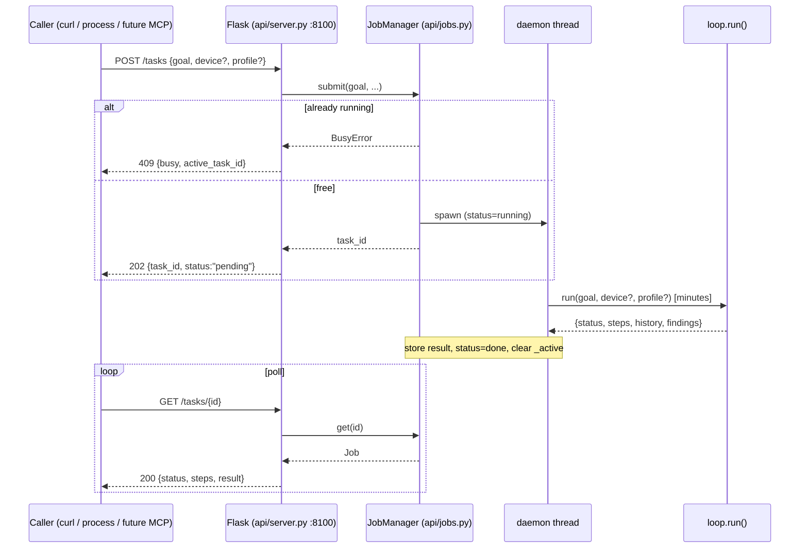

# High Wizard Plan

## **PROJECT INFO**
- **Project**: BRYES
- **Date**: 2026-07-19
- **Agent**: claude-software-architect
- **Theme**: Task-invocation API — expose the existing `run(goal)` as an async HTTP task service (step 0 toward MCP / the loop-as-a-service target), replacing "edit-and-run a Python script" as the only way to give BRYES a task.
- **Source Protocol**: `/high-wizard` — [Procedure](//@agent-memory/control-files/procedures/high-wizard.md)

*CRITICAL INSTRUCTION: To continue this plan: load the source protocol above, then inspect which sections below are filled vs unfilled to infer your current step.*

---

## **OBJECTIVES**
Expose BRYES's existing `run(goal)` as an **async HTTP task service** so a task can be given programmatically (curl, another process, or a future MCP adapter) instead of editing and running a Python script. This is **step 0** toward the MCP / loop-as-a-service direction: the coarse "hand off a whole goal" path where BRYES's **native brain** drives. API-first — HTTP is the universal substrate and an MCP adapter wraps it cheaply later.

### **Related Documents**
- [modularity.mmd](../docs/modularity.mmd) - current module map (the loop is the sole coupler)
- [loop-dispatch.mmd](../docs/loop-dispatch.mmd) - action -> module relation
- [modularity-target.mmd](../docs/modularity-target.mmd) - the loop-as-a-service target this API is the foundation for
- [agent/loop.py](../agent/loop.py) - `run(goal)`, the entry point being wrapped

### **SUCCESS CRITERIA**
- [ ] `POST /tasks {goal, device?, profile?, max_steps?}` starts a task and returns a `task_id` immediately (non-blocking)
- [ ] `GET /tasks/{task_id}` returns `{status, steps, result}`; `result` includes the CONFIRMED FINDINGS ledger (plus history / answer)
- [ ] The task runs `run()` in a background daemon thread; the API stays responsive during a multi-minute task
- [ ] Global single-flight: a 2nd `POST /tasks` while one runs returns `409 Busy`
- [ ] Server binds `127.0.0.1` only, no auth
- [ ] `api/test_jobs.py` + `api/test_server.py` (model-free) cover the JobManager lifecycle and the HTTP routes with a stubbed runner
- [ ] Quality: ruff clean, ASCII-only console output, ADR-008 written, docs touched (context-index, orientation-map, architecture-overview)

---

## **SCOPE**

### In Scope
- New host-side `api/` package: `api/jobs.py` (the `JobManager`), `api/server.py` (Flask app + endpoints), `api/test_jobs.py` + `api/test_server.py` (model-free), and a launch entry
- Small `run()` change: return the CONFIRMED FINDINGS ledger in its result dict (decision 4)
- Device/profile string -> body mapping (reuse the loop's `_ROOT_DEVICE`); omitted -> ADR-006 embodiment auto-select
- Global single-flight lock + in-memory job store
- `flask` added to root [requirements.txt](../requirements.txt) (host dep)
- ADR-008 (task-invocation architecture) + docs touch (context-index, orientation-map, architecture-overview)

### Out of Scope
- The MCP server / adapter (`start_task` / `get_task` tools) - a later step; this HTTP API is its substrate
- The pluggable external-brain seam (`start_task` / `next`, external `decide()`) - a later step
- Cancellation + wall-clock timeout (OQ1) - `max_steps` already bounds a run
- Persistent job store surviving restart (decision 5)
- Auth / non-localhost binding (decision 3)
- Synthesized-answer result — a final Brain summary call (decision 4C) — deferred to the pluggable-brain layer
- Per-device concurrency, a container task + a phone task at once (decision 2B) - an easy later upgrade
- Streaming / progress push - poll `GET /tasks/{id}` only

---

## **CONFIRMED DECISIONS**
*These decisions were collected during investigation — both **asked-and-confirmed** by [USER-NAME] AND **written-through** (Zone A/B decisions made by the agent with reasoning, per [What to Surface](../procedures/wait-options.md#what-to-surface)). The reasons serve as the analysis record.*

| # | Decision | Chosen | Reason |
|---|----------|--------|--------|
| 1 | Web framework / transport | **Flask** | Already a project dep (the container); hand-rolling a stdlib `BaseHTTPRequestHandler` server is materially more boilerplate than the HTTP *client* the stdlib-first ethos actually targets; FastAPI's async is wasted on a sync workload and costs 2 deps. |
| 2 | Concurrency model | Global single-flight (`409` when busy) | Simplest and safe for step 0; BRYES drives one device per run. Per-device concurrency (2B) is an easy later upgrade. |
| 3 | Network binding / auth | `127.0.0.1` only, no auth | Same host as `run()` today, so it exposes nothing new. Add token auth when a remote client needs network reach. |
| 4 | Result shape | status / steps / history **+ CONFIRMED FINDINGS ledger** | The ledger is the task's banked conclusions - makes `GET` genuinely useful with only a small `run()` change. Synthesized answer (4C) deferred. |
| 5 | Job store | In-memory dict | A running task can't survive a host restart anyway (its live device session dies with the process), so persisting records is low-value now. |
| 6 | Async mechanism | One daemon `threading.Thread` per task | `run()` is synchronous and long; the endpoint returns `task_id` immediately while the thread runs the loop. (Zone B disclosure) |
| 7 | Module placement | New host-side `api/` package | Module-per-role convention; kept distinct from `screen/server/` (the container's body API). (Zone B) |
| 8 | Device / profile params | Body-name string (`_ROOT_DEVICE` keys: `android` / `linux`) + profile string/list mapped to `run()`; omit both -> ADR-006 auto-select | Pass-through to the existing `run()` signature; names match the embodiment catalog. (Zone B) |
| 9 | Endpoint paths | `POST /tasks` + `GET /tasks/{id}` | REST-ish; maps cleanly to MCP `start_task` / `get_task` later. (OQ2) |
| 10 | Cancellation + timeout | Out of scope for step 0 | `max_steps` bounds a run; cancellation means interrupting a live thread mid-loop - real complexity. (OQ1) |
| 11 | Runner injection | `JobManager(runner=run)` — injectable, defaults to `loop.run` | Decouples the manager from the real loop so `test_jobs.py` can drive the lifecycle model-free with a stub. (Zone B) |

---

## **SOLUTION**

### Architecture Overview
A new host-side `api/` package wraps the existing `run(goal)` loop ([agent/loop.py](../agent/loop.py)) as an async HTTP service. The loop, Eyes, Brain, and Device are **unchanged** except for one additive tweak (`run()` returns its findings ledger). The API is a thin layer: it accepts a task over HTTP, runs the loop in a background thread, and lets the caller poll for the result — the coarse "hand off a whole goal" path where the native brain drives.

```
POST /tasks {goal,...}                GET /tasks/{id}
      |                                     |
      v                                     v
  JobManager.submit()  --daemon thread-->  Job record {status, steps, result}
      |  (single-flight lock)                    ^
      v                                          |
  loop.run(goal, device?, profile?)  ----banks--> result {status, steps, history, findings}
```

### Component 1: JobManager (`api/jobs.py`)
- **Purpose**: run a task off the HTTP request thread and enforce single-flight, without blocking. Owns task lifecycle + the in-memory store.
- **Design**:
  - `Job` dataclass: `task_id`, `status` (`pending`|`running`|`done`|`failed`), `goal`, `steps` (int|None), `result` (dict|None), `error` (str|None).
  - State: `_jobs: dict[str, Job]`, `_active: str|None` (the running task_id), `_lock: threading.Lock` guarding both.
  - `submit(goal, device=None, profile=None, max_steps=12) -> task_id`: under lock, if `_active` set -> raise `BusyError(active_task_id)`; else create `Job(pending)`, set `_active`, spawn a **daemon `threading.Thread`** running `_run_job`, return `task_id` (`uuid.uuid4().hex`).
  - `_run_job(...)`: `status=running`; `try`: map `device` name -> instance via the loop's `_ROOT_DEVICE` (or `None` -> auto-select); call the injected `runner(goal, device=…, profile=…, max_steps=…)`; store `result` + `steps`, `status=done`. `except Exception as e`: `status=failed`, `error=str(e)` (degrade, never crash the server — quality Dim 1). `finally`: clear `_active` under lock.
  - `get(task_id) -> Job | None`.
  - `runner` is **injectable** (defaults to `loop.run`) so `test_jobs.py` drives the model with a stub (decision 11).
- **Key Files**: `api/jobs.py` (new), `api/__init__.py` (new).

### Component 2: Flask app (`api/server.py`)
- **Purpose**: the HTTP surface — two task routes + a health check, bound to localhost.
- **Design**:
  - `POST /tasks`: parse JSON `{goal (required), device?, profile?, max_steps?}`; missing `goal` -> `400`; `manager.submit(...)` -> `202 {task_id, status:"pending"}`; `BusyError` -> `409 {error:"busy", active_task_id}`.
  - `GET /tasks/<task_id>`: `manager.get()` -> `404` if unknown; else `200 {task_id, status, steps, result, error}`.
  - `GET /health` -> `200 {ok:true}` (readiness, mirrors the container's `/health`).
  - Launch: `app.run(host="127.0.0.1", port=8100, threaded=True)` under a `main()` / `__main__` (port 8100 to avoid the container's 8000).
- **Key Files**: `api/server.py` (new), `../requirements.txt` (add `flask`).

### Component 3: `run()` findings exposure (`agent/loop.py`)
- **Purpose**: surface the task's banked conclusions so `GET` returns a real result (decision 4).
- **Design**: add `"findings": findings` to the `done`, `fail`, and `step_limit` return dicts (additive; the `answered` path has no loop/findings and is unchanged). Existing callers/tests ignore the extra key.
- **Key Files**: [agent/loop.py](../agent/loop.py) (3 return dicts).

### Component 4: Model-free tests (`api/test_jobs.py`, `api/test_server.py`)
- **Purpose**: verify lifecycle + routes without live models or a device (quality Dim 7: prefer model-free).
- **Design**:
  - `test_jobs.py`: inject a stub runner. Assert happy path (`pending -> running -> done`, result stored), single-flight (a slow stub -> a 2nd `submit` raises `BusyError`), failure (a raising stub -> `failed` + `error`), `get(unknown) -> None`.
  - `test_server.py`: Flask `test_client` + stub runner/manager. Assert `POST` -> `202` + `task_id`, `GET` -> status/result, 2nd `POST` -> `409`, `GET` unknown -> `404`, `POST` missing `goal` -> `400`.
- **Key Files**: `api/test_jobs.py` (new), `api/test_server.py` (new).

### System Flow Diagrams

**Current State** (task given only by calling `run()` from Python):
```mermaid
sequenceDiagram
    participant Dev as Developer
    participant Py as Python (script/test)
    participant Loop as agent/loop.py run()
    Dev->>Py: edit a script with a hardcoded goal
    Dev->>Py: python the_script.py
    Py->>Loop: run(goal) [BLOCKS for minutes]
    Loop-->>Py: {status, steps, history}
    Py-->>Dev: printed to stdout
```

**End Result** (async HTTP task service):


### Technical Considerations
- **Threading a synchronous `run()`**: `run()` is blocking + long, so each task runs in a **daemon thread**; the Flask request thread returns immediately. `run()` is I/O-bound (network waits on OpenRouter / the device), so the GIL doesn't stall the background thread — Flask (`threaded=True`) keeps serving `GET` polls meanwhile.
- **Single-flight race**: a `threading.Lock` guards the `_active` check-and-set so two near-simultaneous `POST`s can't both start.
- **Flask dev server**: `app.run()` is the Werkzeug dev server — fine for localhost single-user step 0; NOT a production WSGI server. Note for the remote step: swap to `waitress`/`gunicorn` when binding beyond localhost.
- **`run()` return change is additive**: adding `findings` must not break a test asserting exact dict equality — verify existing `agent/` tests during Step 1.1.
- **Result JSON-serializability**: `run()`'s result is plain `str`/`int`/`list` (status, steps, history strings, findings strings) — safe for `jsonify`.
- **Device session lifetime**: a running task holds a live Device (container HTTP / phone adb); if the host process dies the task dies — which is exactly why the in-memory store (decision 5) is sufficient.

### Solution Options & Evaluation

#### Solution Options
| # | Solution | Description |
|---|----------|-------------|
| 1 | CLI wrapper | An `argparse` entry (`python -m bryes "goal"`). Programmatic-ish, but still a process invocation: blocking, no concurrent status, not callable by a running service/agent. |
| 2 | Synchronous HTTP endpoint | `POST /run` blocks until the task finishes, returns the result. Simplest server, but a multi-minute blocking call -> client timeouts, zero progress, a tied-up connection. |
| 3 | **Async HTTP task service (CHOSEN)** | `POST /tasks` -> `task_id`; `GET /tasks/{id}` polls. Non-blocking, robust for long tasks; the `start -> poll` skeleton is the exact base the pluggable-brain layer extends. |
| 4 | MCP-first | Build a native MCP server exposing `run()` as a tool now. But a multi-minute blocking tool fights MCP, and HTTP is the more universal substrate MCP can wrap. |
| 5 | Fine-grained body tools | Expose Eyes+Hands as tools an external brain composes. More freedom, but needs knowledge extraction + external orchestration; superseded near-term by the loop-as-a-service cut. |

#### Evaluation
| Solution | Pros | Cons |
|----------|------|------|
| 2 Sync HTTP | Simplest server; one round-trip | Multi-minute block -> timeouts, no progress, connection tied up |
| 3 Async HTTP | Non-blocking; robust for long tasks; reusable `start->poll` skeleton; testable | Needs a job manager + polling |

#### Selected Approach
- **Chosen**: 3 — async HTTP task service.
- **Rationale**: a whole task is minutes, so blocking (2) is a non-starter for real use; and the `start -> poll` skeleton is exactly what the later pluggable-brain seam (`start_task` -> `next`) extends — so this is foundation, not throwaway. CLI (1) doesn't serve agent-to-agent; MCP-first (4) and fine-grained tools (5) are later layers over this substrate.

### ADR Output
- **ADR File**: [docs/adr/2026-07-19-task-invocation-api.md](../docs/adr/2026-07-19-task-invocation-api.md) — ADR-008
- **Decision Summary**: BRYES tasks are invoked through an **async HTTP task service** (`POST /tasks` -> `task_id`, `GET /tasks/{id}` polls) wrapping the native `run()` loop; API-first with MCP as a later thin adapter.

---

## **IMPLEMENTATION PHASES**

### Phase 1: Core — findings exposure + JobManager
- [ ] **Step 1.1**: Expose findings from `run()`
  - **Action**: Add `"findings": findings` to the `done` / `fail` / `step_limit` return dicts in [agent/loop.py](../agent/loop.py).
  - **Implementation**: Three additive edits; the `answered` path is untouched.
  - **Testing**: Grep existing `agent/` tests for exact-dict-equality on `run()`'s return; run them to confirm still green.
  - **Success Criteria**: `run()` returns include `findings`; no existing test breaks.

- [ ] **Step 1.2**: `api/jobs.py` — the JobManager
  - **Action**: Create `api/__init__.py` + `api/jobs.py` with `Job`, `BusyError`, `JobManager` (in-memory store, single-flight lock, daemon-thread runner, injectable `runner`, device-name mapping via the loop's `_ROOT_DEVICE`).
  - **Implementation**: `uuid4().hex` task ids; `_run_job` degrades exceptions to `status=failed` + `error` (never crashes the server).
  - **Testing**: Covered by Step 1.3.
  - **Success Criteria**: JobManager compiles; ruff clean.

- [ ] **Step 1.3**: `api/test_jobs.py` — model-free lifecycle test
  - **Action**: Stub-runner tests: happy path (`pending->running->done` + result), single-flight (`BusyError` on 2nd submit while a slow stub runs), failure (`failed` + error), `get(unknown)->None`.
  - **Implementation**: `python api/test_jobs.py`, ASCII `PASS:`/`FAIL:` markers.
  - **Testing**: Run it -> all pass.
  - **Success Criteria**: All lifecycle assertions pass without any live model/device.

### Phase 2: HTTP surface
- [ ] **Step 2.1**: `api/server.py` — Flask app
  - **Action**: `POST /tasks` (validate goal, submit, 202/409/400), `GET /tasks/<id>` (200/404), `GET /health`; bind `127.0.0.1:8100`, `threaded=True`; `main()`/`__main__` launch.
  - **Implementation**: One shared `JobManager` instance; `jsonify` the Job record.
  - **Testing**: Covered by Step 2.3.
  - **Success Criteria**: Server imports + starts; routes registered.

- [ ] **Step 2.2**: Add `flask` dependency
  - **Action**: Add `flask` to root [requirements.txt](../requirements.txt) with a comment (host task API).
  - **Testing**: `pip install -r requirements.txt` resolves.
  - **Success Criteria**: `import flask` works on the host.

- [ ] **Step 2.3**: `api/test_server.py` — model-free route test
  - **Action**: Flask `test_client` + stub runner: `POST`->202+task_id, `GET`->status/result, 2nd `POST`->409, `GET` unknown->404, `POST` missing goal->400.
  - **Testing**: `python api/test_server.py` -> all pass; `ruff check api/`.
  - **Success Criteria**: All route assertions pass; ruff clean.

### Phase 3: ADR + docs
- [ ] **Step 3.1**: ADR-008
  - **Action**: Create [docs/adr/2026-07-19-task-invocation-api.md](../docs/adr/2026-07-19-task-invocation-api.md) from section F + the decisions; link plan <-> ADR.
  - **Success Criteria**: ADR-008 exists, numbered, cross-linked.

- [ ] **Step 3.2**: Docs touch
  - **Action**: Update [context-index.md](../docs/context-index.md) (api/ + a task-API quick fact), [orientation-map.md](../docs/orientation-map.md) (api/ module entries + an ADR-008 entry), [architecture-overview.md](../docs/architecture-overview.md) (a Task API note + repo layout + phase status).
  - **Success Criteria**: Docs reference the new API; orientation map indexes it.

- [ ] **Step 3.3**: Final lint pass
  - **Action**: `ruff check api/ agent/loop.py`; confirm ASCII-only console output in the new files.
  - **Success Criteria**: ruff clean; no non-ASCII in our console output.

---

## **EXECUTION LOG**
**Execution Protocol for AI**:
I have to use this document as my **ONLY** source of truth to execute and track the plan steps iteratively. I should **NOT** use additional tools like ToDos because it lacks the context of what should I do. Everytime I want to implement a step I have to check the reference to the original step plan above. Everytime a step has been finished I need to go back to this document to log what was done.
*In other words*:
- I have to make this document as the source of truth for the implementation phase on what I have worked on and what I will be working
- The original plan must be fully in my context, therefore, I have to make sure I loaded the **Plan File** before executing any task and read carefully the reference to the original step
- I have to do the implementation by doing it in order per step THEN, I ALWAYS have to fill the step log rightly after

**Definition of Done (applies to ALL steps)**:
- ✅ **Code Quality**: Code compiles/runs without errors
- ✅ **Testing**: Tests written and passing
- ✅ **Logged**: Implementation and testing logged below
- 🚫 **Blocked**: Get input from [USER-NAME] before assuming

### Phase 1:
- [x] **Step 1.1**: [Expose findings from run()](#phase-1-core--findings-exposure--jobmanager)
  - **Implementation Log**: Added `"findings": findings` to the three loop return dicts in [agent/loop.py](../agent/loop.py) — `done`, `fail`, and `step_limit`. The `answered` path (no loop) is untouched (it has no findings ledger).
  - **Testing Log**: `py_compile` OK. Scanned `agent/test_*.py`: `test_phase4` + `test_condition_ledger` access `run()`'s return by key (`result["status"]`, `res.get("status")`); the only exact-dict-equality assertions (test_run_selection L43/L49) are on `resolve_embodiment`, not `run()`. Ran both model-free tests: `test_condition_ledger.py` 15/15 PASS, `test_run_selection.py` 8/8 PASS.
  - **Success Criteria**: PASS — `run()` returns include `findings`; no existing test breaks.
  - **Tech Debts**: None.
  - **Result**: Findings ledger now surfaced in every loop-terminating return; ready for the API to expose it.

- [x] **Step 1.2**: JobManager (`api/jobs.py`)
  - **Implementation Log**: Created [api/__init__.py](../api/__init__.py) + [api/jobs.py](../api/jobs.py): `Job` dataclass (task_id/goal/status/steps/result/error + `.public()` JSON view), `BusyError` (carries `active_task_id`), `JobManager` (in-memory `_jobs` dict, `_active` + `threading.Lock` single-flight, `uuid4().hex` ids, daemon-thread `_run_job`, injectable `runner` defaulting to `agent.loop.run`). Device handling: a body-name string -> `_make_device` (reused from the loop), None -> auto-select, an already-built Device passes through. `_run_job` writes result/steps BEFORE flipping status to `done`, and degrades any exception to `status=failed` + `error` (never crashes the server — quality Dim 1).
  - **Testing Log**: Covered by Step 1.3.
  - **Success Criteria**: PASS — compiles; ruff to be run in Step 2.3/3.3.
  - **Tech Debts**: An invalid device-name currently surfaces as a `failed` job (via `_make_device` raising inside the thread) rather than a submit-time 400 — acceptable for step 0.
  - **Result**: The async single-flight job core is in place, decoupled from the real loop via the injectable runner.

- [x] **Step 1.3**: `api/test_jobs.py`
  - **Implementation Log**: [api/test_jobs.py](../api/test_jobs.py) — stub-runner tests, model-free: happy path (pending->running->done, result stored verbatim, steps pulled, runner received goal/max_steps/profile, device None), single-flight (a slow stub keeps task running -> 2nd submit raises `BusyError` naming the active id -> slot freed on completion), failure (raising stub -> `failed` + typed error -> slot freed), `get(unknown)->None`, and non-string device pass-through.
  - **Testing Log**: `python api/test_jobs.py` -> **ALL PASS (18)**; completes in <1s, no live model/device.
  - **Success Criteria**: PASS — all lifecycle assertions pass model-free.
  - **Tech Debts**: None.
  - **Result**: JobManager lifecycle + single-flight + error capture verified deterministically.

### Phase 2:
- [x] **Step 2.1**: `api/server.py`
  - **Implementation Log**: [api/server.py](../api/server.py) — a `create_app(manager=None)` **app-factory** (Flask idiom, so tests inject a stub-backed manager): `POST /tasks` (validate goal -> 400; `submit` -> 202 `{task_id, status}`; `BusyError` -> 409 `{error, active_task_id}`; passes `device`/`profile`/`max_steps` through only when given), `GET /tasks/<id>` (`job.public()` -> 200 / 404), `GET /health` -> 200. `main()` runs `create_app().run("127.0.0.1", 8100, threaded=True)`.
  - **Testing Log**: Covered by Step 2.3.
  - **Success Criteria**: PASS — imports, routes registered, compiles.
  - **Tech Debts**: Werkzeug dev server (fine for localhost/step 0); port 8100 hardcoded.
  - **Result**: The 2-endpoint async surface is live over the JobManager.

- [x] **Step 2.2**: Add `flask` dependency
  - **Implementation Log**: Added `flask>=3` to root [requirements.txt](../requirements.txt) with a comment (the host task API).
  - **Testing Log**: `pip install "flask>=3"` -> **flask 3.1.3**; `import flask` works on the host.
  - **Success Criteria**: PASS.
  - **Tech Debts**: None.
  - **Result**: Host can serve the API.

- [x] **Step 2.3**: `api/test_server.py`
  - **Implementation Log**: [api/test_server.py](../api/test_server.py) — Flask `test_client` over a stub-runner app: POST->202+task_id/pending, poll GET->200 done with the findings surfaced in `result`, missing/empty goal->400, 2nd POST while a slow stub runs->409 naming `active_task_id`, GET unknown->404, GET /health->200.
  - **Testing Log**: `python api/test_server.py` -> **ALL PASS (9)**, model-free. `python -m ruff check api/ agent/loop.py` -> **All checks passed!**
  - **Success Criteria**: PASS — routes verified; ruff clean.
  - **Tech Debts**: None.
  - **Result**: Full HTTP surface verified end-to-end without live models/device.

### Phase 3:
- [x] **Step 3.1**: ADR-008
  - **Implementation Log**: [docs/adr/2026-07-19-task-invocation-api.md](../docs/adr/2026-07-19-task-invocation-api.md) created (during High-Wizard Phase 2) from section F + the decisions; problem/decision/requirements/alternatives filled. Cross-linked: the ADR links back to this plan, and section G links to the ADR. Corrected one factual overstatement (the container's body API is a non-test `__main__`).
  - **Testing Log**: N/A (doc). Links verified by path.
  - **Success Criteria**: PASS — ADR-008 exists, numbered, cross-linked.
  - **Tech Debts**: None.
  - **Result**: The task-invocation decision is recorded.

- [x] **Step 3.2**: Docs touch
  - **Implementation Log**: Created [api/README.md](../api/README.md) (module convention — every other module has one). Updated [orientation-map.md](../docs/orientation-map.md) (new `api/README.md` entry + `ADR-008` entry), [context-index.md](../docs/context-index.md) (a "Run the Task API" quick fact), [architecture-overview.md](../docs/architecture-overview.md) (an `api/` repo-layout bullet).
  - **Testing Log**: N/A (docs).
  - **Success Criteria**: PASS — the new API is referenced from the module map, context index, and architecture overview.
  - **Tech Debts**: `last_full_scan` in the orientation map left at 2026-07-12 (entries added incrementally, not a full rescan) — acceptable.
  - **Result**: The API is discoverable via the standard docs.

- [x] **Step 3.3**: Final lint pass
  - **Implementation Log**: `py_compile` on all four `api/*.py` + `agent/loop.py`; fixed two module-docstring em-dashes to `--` for ASCII consistency.
  - **Testing Log**: `python -m ruff check api/ agent/loop.py` -> **All checks passed!**; ASCII-check -> **ASCII-clean: all api/*.py**; re-ran `test_jobs.py` + `test_server.py` -> both OK.
  - **Success Criteria**: PASS — ruff clean, ASCII-only, tests green.
  - **Tech Debts**: None.
  - **Result**: All new/modified code is clean and verified.

---

## **QUALITY REVIEW**
*Filled by procedure Step 16 (delegated to `/analyze-code-quality` in embedded mode) after all execution phases are complete. **Static** review — answers "is the code clean?".*

- **Scope**: code — `api/__init__.py`, `api/jobs.py`, `api/server.py`, `api/test_jobs.py`, `api/test_server.py`, `agent/loop.py`; supporting — `requirements.txt`, `api/README.md`, ADR-008, orientation-map / context-index / architecture-overview (docs, reviewed for accuracy). **Reconciliation**: `git diff` also shows 4 earlier-session artifacts (`docs/modularity.mmd`, `modularity-target.mmd`, `loop-dispatch.mmd`, `docs/README.md`) — excluded from *code* quality (design docs/diagrams, not this task's code).
- **Quality Standard**: [docs/quality-standard.md](../docs/quality-standard.md), 9 dimensions. Dims 2 (State) + 3 (UX) N/A (no UI). Dims 1/4/5/6/7/8/9 pass: degrade-not-crash (`_run_job` -> `failed`, never crashes the server), no model calls added, `.env` untouched + localhost-only, ASCII-clean console, snake_case + module-per-role + co-located model-free tests, ruff clean, JSON via `jsonify` (framework-enforced, not hand-built). **LF-clean**, **ruff clean**, **27/27 model-free tests green**.
- **Findings**: 3 Low (no Critical/Medium).

| # | Severity | File | Issue | Fix Options |
|---|----------|------|-------|-------------|
| 1 | Low | `api/server.py` (POST /tasks) | `max_steps`/`device`/`profile` aren't type-validated at the boundary; a bad `max_steps` type reaches `run()` and errors in the worker thread -> a cryptic `failed` job instead of an immediate `400`. | A) coerce+validate `max_steps` to int (reject unknown device names) -> `400` on bad input; B) leave (degrades to a `failed` job) |
| 2 | Low | `api/server.py:31-32` | `HOST`/`PORT` (8100) hardcoded, not env-overridable. | A) read `BRYES_API_PORT`/`HOST` from env, constants as default; B) leave (known tech debt) |
| 3 | Low | `api/jobs.py` (`_jobs`) | Completed jobs are never evicted; the dict grows unbounded over a very long-lived server. | A) cap / TTL completed jobs; B) leave (aligned with the in-memory step-0 decision) |

- **Fixed** (USER: 1=A, 2=B, 3=A):
  - **#1 (A)** — `POST /tasks` now validates `device` against `KNOWN_DEVICES` (`frozenset(_ROOT_DEVICE)`, added to `jobs.py`) and `max_steps` as a positive int → `400` on bad input (`profile` still validated by `run()`). Coverage: `test_server.py::test_bad_input_400` (bad `max_steps` type, `max_steps<1`, unknown device → all 400).
  - **#2 (B)** — skipped (hardcoded port stays a tracked tech debt).
  - **#3 (A)** — `JobManager(max_jobs=100)` + `_prune_locked()` evicts the oldest terminal (done/failed) jobs beyond the cap (never the active one). Coverage: `test_jobs.py::test_eviction` (5 tasks, cap 3 → bounded, oldest evicted, newest retained).
  - **Verified**: `test_jobs.py` 21/21, `test_server.py` 12/12 (**33 total**), ruff clean.

---

## **FINAL INTEGRATION TEST**
*Filled by procedure Step 17 after Quality Review is resolved. **Runtime** verification — answers "does it actually work end-to-end?".*
*Note: the cheapest e2e is an ANSWER-ONLY task (`device=None`, e.g. "capital of France?") — POST -> thread -> `run()` answer path (one Brain call, no device) -> GET returns `{status:done, result:{answer}}`. A full loop task on a real device is the heavier verification.*

- **Scope**: `api/server.py` + `api/jobs.py` + `agent/loop.py` — the full `POST -> thread -> run() -> poll` stack.
- **qa/ Status**: Skipped — BRYES has no `qa/` instrument, and for a 2-endpoint API the answer-only smoke is the pragmatic runtime check (a full R/I/A/O instrument would be overkill here).
- **Playbooks Run**: N/A
- **R/I/A/O Results**: N/A
- **Findings**: **None — live e2e clean.** Started the real server (`:8100`); `GET /health` -> `{"ok":true}`; `POST /tasks {"goal":"What is the capital of France? Answer in one word."}` -> `202 {task_id, pending}`; polled `GET` -> `pending -> running` (~6s) -> `done`; `result = {"status":"answered","answer":"Paris","reason":...}`, `steps=null` (answer-only path, no loop), `error=null`. The full HTTP -> JobManager -> daemon thread -> `run()` (embodiment select -> answer) -> stored result -> GET poll chain works against the running server (verified live, not inferred - c4f7a2e9). Server stopped cleanly.
- **Fixed**: N/A (no failures).
- **Coverage note (honest)**: the live smoke exercised the **answer-only** path (device=None). The **loop-task** result path (a real device run returning `history` + the `findings` ledger) is covered by the **model-free** `test_server.py` (stub runner asserts `findings` surfaces in `result`) but was NOT run live — a full device task over the API is the deeper verification, available when a real task is next driven through it.

---

## **POST-COMPLETION**
After all phases are executed, logged, and both **Quality Review** + **Final Integration Test** are filled, move this plan to `plans/completed/`:
`mkdir -p ./plans/completed && mv ./plans/2026-07-19-BRYES-task-invocation-api.md ./plans/completed/2026-07-19-BRYES-task-invocation-api.md`
